# NFL Betting Market Prediction and Analysis

Sports betting is a multi-billion dollar per year industry.  Estimates vary, but the Nevada Gaming Commission reported over $3.2B in legal gambling in 2011, with 41% of that money being wagered on football alone. [__1__](#fn1)  According to NBA commissioner Adam Silver, if illegal gambling is counted the annual total for American gambling jumps to $400B. [__2__](#fn2)   The single biggest betting event in America is the Super Bowl, which now attracts over $100M in legal bets and potentially ten times that amount illegally. [__3__](#fn3)  With such sums of money flowing into the betting market, I was curious to see if I could isolate some -- _any_ -- notable inefficiency which would give a leg up on betting intelligently.  

The oddsmakers in Vegas use networks of supercomputers to set the odds, so expecting to beat them outright with a single machine learning model is a bad bet, no pun intended.  However, my hope was that systemic inefficiencies could be ferreted out as Vegas must also shift the odds based on __how the public bets__ in order to prevent a catastrophic loss of house money should an upset occur, granting the one-sided public bets all large payouts.  This opens the door for the informed bettor (us) to profit by the uninformed bettors (the public) making bad choices and forcing Vegas to alter the odds in an inefficient manner. In the interest of full disclosure, I have never bet a penny in my life (not even on slot machines -- sorry, casinos).  

 
 

## Table of Contents
1. [Dataset](#dataset)
    + [Advanced Metrics](#advanced-metrics)
    + [Acquisition and Error Correction](#acquisition-and-error-correction)
    + [Feature Engineering](#feature-engineering)
2. [NFL Betting Primer](#nfl-betting-primer)  
    + [Interpreting Odds and the Payout](#interpreting-odds-and-the-payout)
    + [The Spread](#the-spread)
    + [The Over/Under](#the-over-under)
    + [The Money Line](#the-money-line)  
3. [Wise Bets](#wise-bets)  
4. [Model Selection](#model-selection)   
    + [Data Selection](#data-selection)
    + [Classification vs. Regression](#regression-vs-classification)
    + [Model Selection and Training](#model-selection-and-training)
      + [Tree-based Feature Importance](#feature-separation-and-importance)
    + [Class Inspection](#class-inspection)
      + [PCA](#principal-component-analysis)
      + [t-SNE](#t---sne)
      + [Feature Overlaps](#feature-overlaps)
5. [Results](#results)
    + [Spread Results](#spread-results)
      + [Summary Stats](#spread-summary-stats)
      + [Accuracy](#spread-accuracy)
      + [Feature Importance](#feature-importance)
      + [Analysis](#spread-analysis)
    + [Over/Under](#over---under)
      + [Summary Stats](#over---under-summary-stats)
      + [Accuracy](#over---under-accuracy)
      + [Feature Importance](#over---under-feature-importance)
      + [Analysis](#over---under-analysis)
    + [Money Line](#money-line-results)
    + [Predicting Bet Outcomes](#predicting-bet-outcomes)
    + [Predicting the Winner](#predicting-the-winner)
      + [Summary Stats](#winner-summary-stats)
      + [Accuracy](#winner-accuracy)
      + [Feature Importance](#winner-feature-importance)
    + Weather
      + TEMP/wind/wc plots
    + Wise Bets Results
      + Spread
      + Over/Under
      + Money Line
        + 91.5% R2 with Spread when predicting proba...
        + Try Seaborn RegPlot and lmplot with some targets/wise/proba/etc
      + Biggest Bet Upsets?
    + Hypothetical Bettor Using This Model
      + Money Line
    + Clusters - Four Types
6. [Future Considerations](#future-considerations)  
    + Dynamic Web App
    + Player-specific Information
      + Injuries
      + Current-season Performance
    + Miles Traveled

 
 
 

## Dataset
The point of this entire project was to use team-level data to identify trends in how Vegas oddsmakers set the odds for a given game.  However, as this model aims to predict single game results, it requires the stats and information for each of the two teams in a given game up to that point in the given season.  This meant I needed to procure game-by-game detailed information for every statistic, and not merely season-long summary information.  The types of statistics and information I wanted to model included all in-game statistics, weather, stadium information, and advanced analytics.

### Advanced Metrics
Sports analytics has grown from a small cottage industry in the mid-1980s to a robust field unto itself in 2017.  My aim was to leverage as many 'advanced' as possible metrics to improve my model's accuracy.  Some of these metrics are proprietary and available only through subscriptions to their respective stat-owning websites, such as the _Defense-adjusted Value Over Average_ (DVOA) metrics from [Football Outsiders](http://www.footballoutsiders.com/) or _Clutch-weighted Quarterback Rating_ (QBR) and Brian Burke's _Football Power Index_ (FPI) from [ESPN Insider](http://www.espn.com/insider/).  

Other metrics, such as _Pythagenport Win Expectancy_, a mildly revised descendent of baseball Sabremetrics godfather Bill James' famous _Pythagorean Win Expectancy_ metric, or _Adjusted Net Yards Per Attempt_ (ANY/A), most recently modified by Chase Stuart of [Football Perspective](http://www.footballperspective.com/tag/anya/), must be calculated.  Another excellent team-level advanced metric is _Expected Points Added_ (EPA), which originates from the seminal "Hidden Game of Football" published in the late 1980s by Bob Carroll and Pete Palmer, and has been updated by the folks at [Pro-Football Reference](http://www.sports-reference.com/blog/2012/03/features-expected-points/).   

Due to the proprietary nature of some of the advanced metrics, and the reliance upon more granular statistics for others, they are not available for the entirety of the dataset itself.  Vegas line information only goes back to the 1978 season, meaning 1978 is the earliest possible season for this model.  Time of possession information starts in 1983, 3rd and 4th Down success rates as well as DVOA begin in 1991, and EPA starts in 1994.  In the future as more old game logs and old game films are parsed and logged, it will be possible for these insightful advanced metrics to be extended further back into league history.  The selection of data from this parent dataset will be discussed below under [Data Selection](#data-selection).

### Acquisition and Error Correction
Unfortunately, no single source exists which has all these statistics.  In an effort to use as many of these stats as possible I decided to scrape the desired single-game statistics from [Pro Football Reference](http://www.pro-football-reference.com) (PFR) using BeautifulSoup and urllib.  PFR is known as the online encyclopedia for all things pro football, and has detailed information for nearly each game played in pro football history, including stadium type, time of game, weather, and Vegas betting information.  Regarding scraping of their site, PFR makes the following pro-scraping statement on their [data use](http://www.sports-reference.com/data_use.html) page:
>We will not fulfill any requests for data for custom downloads, unless you are prepared to pay a minimum of $1,000 for any such request.
>
>We realize this will be insurmountable for any student requests. However, I would point out that learning how to accumulate data is often a more valuable skill than actually analyzing the data, so we encourage you as a student or professional to learn how.

In total, I obtained 181, 285 separate tables.  Around 30,000 of these were used in this project.  In order to utilize them, I first had to do modify them for uniformity and then create a table for each team that summarized their progress through a given season, game by game, with around 300 added features that covered both single-game and running total statistics.  Once completed, the final database was formed by stitching the statistics for each home team and road team together for every game from 1950-2016 into a single entry. For games that have Vegas-related information, which starts in 1978, this totals around 12,500 games.

Surprisingly, most of PFR's data was well-maintained.  There were, however, two notable errors.  First, _time of possession_ data for all post-season games from 1991-1998 was missing.  I looked up each of these games and manually entered the correct data.  Second, 87 games had missing weather data (temperature, wind chill, wind speed (mph), and humidity), which forced me to manually look up the weather in the city the game was played in on the date of the game, and insert into the database one-by-one.  (_Surprise_, it's hot and dry in Arizona).  

A total of 1817 games were played in a closed-roof, climate-controlled dome, starting in 1968.  (For clarity, some stadia have retractable roofs, so only games played with the roof closed are logged as 'dome' games).  After reading online about typical conditions inside a domed stadium, I set dome-game temperatures to 67° F, no wind, and no humidity.  There were 1961 games inside of a domed stadium from 1978-2016, totaling around 21% of all games played.  Wind chill was also calculated for each game with a temperature below 50° F using the modern formula of 35.74 \+ (0.6215 \* Temp) - (35.75 \* Wind0.16) \+ (0.4275 \* Temp \* Wind0.16). [__4__](#fn4)

Last, as a long-time paying member at Football Outsiders, I was able to obtain all the DVOA data in their databases, which runs back to 1991 as of February 2017.

### Feature Engineering
I engineered features in seven distinct ways.
1. __Per-game averages__ for each team in every statistic.  This was necessary for two concrete reasons.
    1. Not every season in NFL history has had the same number of games.
    2. Within a season, teams regularly play an opponent that has not played the same number of games at they have at that point in the season.  Simply using season-long running-total values would skew things in favor of the team that had played more games for positive stats and in favor of the team that had played fewer games for negative stats.   By converting every statistic to a per-game value, we are comparing apples-to-apples.
2. __Deltas__ between the two teams in given statistics, resulting in a single statistic describing the relationship between the teams for the given game.   
    _Example:_ home team averages +103 more yards passing per game than the road team.
3. __Aggregation__ of similar statistics into a single metric.  
    _Example:_ find how many standard deviations a team is above or below league average in a given stat for a given week, and accumulate these for all relevant offensive or defensive stats into a single statistic, such as "Offensive Sigma".
4. __Binning__ of a given statistic into quintiles.
5. __Clustering__ of advanced metrics in an effort to identify "types" of game matchups.
6. __Dummying__ of categorical data, such as day of the week per game, type of stadium (dome or open), type of playing surface, and week of the season.
7. Calculating exact hours of rest between games, not merely days.  

 
 
 

## NFL Betting Primer
Each bet has different odds depending on which side of the bet you take.  There are three primary types of wagers made on NFL games:
1. The spread
2. The over/under
3. The money line  

#### Interpreting Odds and the Payout
When a money line or spread is negative for a given team, this means that team is favored to win.  As such, the payout for that bet is less favorable than for the underdog.  All odds are given relative to a wager of $100.  An example is easiest to demonstrate.  If Team A is the favorite and has odds (money line) of -200, this means you must bet $200 to win (net) $100 (the $200 you originally bet plus $100 in winnings).[__5__](#fn5)  Since Team A is favored this makes sense -- you must risk more money in order to profit since they're expected to win.  Conversely, if Team B is an underdog and has odds of +300, you will win (net) $300 with a wager of only $100.  Again, Team B is not expected to win, so to entice bettors to take the bet, the reward must be greater than the risk.

#### The Spread
The spread, also called the "line", is a measure of how much better Vegas thinks Team A is than Team B.  In other words, it's a handicap.  Vegas sets the spread in the amount of points the favored team is expected to win by.  A negative spread indicates a team is favored, positive an underdog.  For example, a spread of -3.0 means the favored team is expected to win by a field goal (3 points).  You can bet on either team, the favorite or underdog.  In order to win a bet on the spread, your team must exceed the spread in your favor.  So, if you bet on the favorite at -3.0, they must win by _more_ than 3 points for your bet to win.  If they win by exactly 3 points, the result is called a "push", and all money is returned to bettors, none having been won nor lost.  

Even moderate sports fans are doubtless familiar with the notion of "home field advantage," and we see it borne out in the history of the Vegas NFL spread.  The peaks in the distribution represent the most common increments of scoring in football: 3 points, 7 points, 10 points, and 13 points.  Note the aversion to setting the line at 0 points, as this is equivalent to simply picking the winner outright.  Also note the significant majority of lines are set favoring the home team, offering real evidence of the notion of "home field advantage."

  

__Figure 1:__ The historical distribution of the Vegas spread for NFL games from the perspective of the visiting team.  Excluding the intentional dip at 0 points, the spread conforms to a roughly normal distribution with a mean close to +2.4 points. 

 

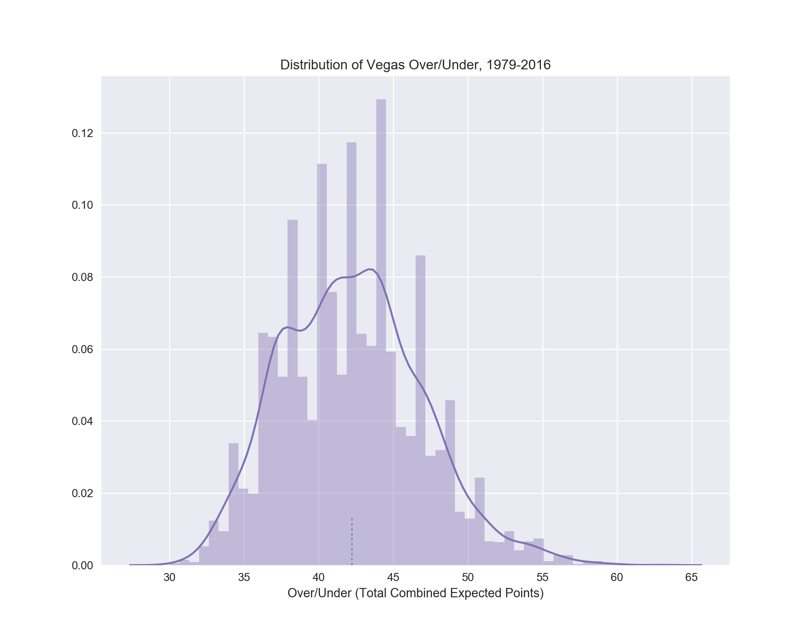  

#### The Over/Under
The Over/Under is simply the total expected number of points scored by both teams in a game.  You can bet the Over or the Under, and will win if the combined score of the teams is either more than (over) or less than (under) the set Over/Under value, depending on your wager.  If the final combined score equals the Over/Under value exactly, the bet ends in a "push" and all money is returned.  

    

<b>Figure 2:</b> The historical distribution of the Vegas Over/Under for NFL games. The mean is denoted
 
by the small dashed line at 42.2 points. Again, we observe here a gaussian distribution. 

 

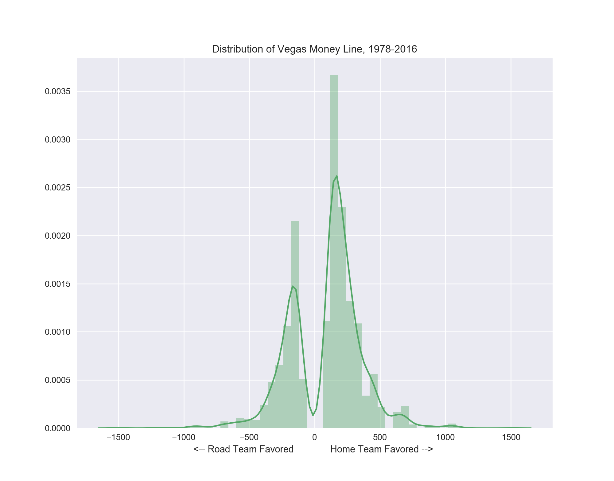  

#### The Money Line
The money line is simply the odds that a specific team will win the game, regardless of margin of victory (spread).  The money line is given in odds and like the spread a negative value denotes the favored team, and the odds themselves indicate what the [payout](#interpreting-odds-and-the-payout) will be for a winning bet.  Again owing to the notion of "home field advantage", the average money line for a favored road team is -230, while the average for a home favorite is -313.  

  

<b>Figure 3:</b> The historical distribution of the Vegas Money Line for NFL games. Split much like
 
the spread, the money line shows the higher value and density of home favorites.

  

 

All things considered, you must risk more money when betting on a home team as they're expected to win more frequently.  This trend holds true for underdogs as well; you win more money from the average road underdog (+248) than the average home underdog (+179).

 
 
 

## Wise Bets
Games that pass a user-set threshold of deviation from the model's prediction, either in a point spread, over/under, or in odds to win are labeled as __wise bets__.

###### Spread Wise Bets
A game whose actual spread deviates from the predicted spread by the user-set point threshold or more will be labeled a "wise bet".  The underlying approach to finding mis-valued spreads works as follows.  The key factor for a spread is its _flexibility_. As Vegas receives more bets on a particular team at a given spread value, they can adjust the spread in order to balance the wagers on the opposing team, reducing the bookmakers' risk by taking near equal money on both sides.  (Vegas typically does not win big on any given game.  They win small amounts consistently by playing percentages very carefully).  

This flexibility in the line is the key component I aimed to use in snuffing out inefficiency in the spread.  If the betting public has a possibly inaccurate perception about a given team, they will either over- or under-bet for that team, forcing Vegas oddsmakers to compensate by artificially adjusting the spread in order to entice bettors to make wagers against their (inaccurate) perception and even out the money wagered.  

Because of this, the initial aim of this project was simple: I wanted to identify which factors best predict games that have spreads that are incorrectly set, to label these games as potentially "wise bets," and to examine the results of these games in hopes of finding that a favorable percentage would be winning bets.

###### Over-Under Wise Bets
Secondarily, we can do the same for the Over/Under: use our model to predict the over/under for a game and then bet on games whose predicted over/under deviates by a set amount from the actual over/under.

###### Money Line Wise Bets
Last, we can simply try to predict the winner of a game (this bet is made using the money line, hence the money line name).  These bets are divided into picking either the home team or the road team.  Home teams win more and are favored more, accordingly.  We can use our model to learn as many trends as possible for a given matchup and predict whether the home team will win or lose with a certain degree of confidence.  We can then bet on games that exceed a set level of confidence.

 
 
 

## Model Selection
Four models were tested in this project: two tree ensemble methods, Random Forests (RF) and Gradient Boosted Trees (GBT), as well as Support Vector Machines (SVM) and finally ElasticNet regression.  The GBT models are from __XGBoost__ while the rest are from __Sci-Kit Learn__.

### Data Selection
As mentioned above, there were three divisions of the original dataset features, as well as up to five progressively smaller year ranges of games to inspect.

#### Feature Separation and Importance
The feature-set division arises from my desire to answer the following question: _which single statistics are the most important in predicting X result for an NFL game?_  

The easiest and most direct way to do this is to use a model which has a feature importance attribute.  Gradient Boosted Trees do, and so served this role in this project.  There are two ways of finding the feature importance in ensemble tree models like Random Forests and Gradient Boosted Trees: first, each model has its own attribute which will tell you which features gave the highest return in purity or lowest return in error for the single fitting and run of the model.  Second, a more robust approach is to use Recursive Feature Elimination (RFE), which is calculated by fitting the model with all but one feature, measuring how well it predicts, and then repeating this for all features in the dataset until each one has had a turn being left out.  The features that caused the greatest drop in prediction accuracy are judged to be the most important.

However, if any two features are closely related, the importance for either one will be largely negated by the existence of the other.  For example, pretend we have the two following statistics in this database: _touchdowns in the first three quarters_ and _touchdowns for the entire game_.  When the the stat for the _entire game_ is removed and the model measures how accurate its predictions are, it will still have a feature included that provides three-quarters of the removed _entire game_ stat's information, and the prediction accuracy won't be severely impacted.  As a result, the _touchdowns for the entire game_ statistic will be reported as not being a very important feature.  However, the reality is that this would indeed be an important statistic, but having a correlated or, in this case, partially duplicated feature clouds our ability to determine its true importance.

Because of this fact, I split the feature set into three parts:
1. All statistics
2. Raw statistics
3. Matchup deltas

_Raw_ stats are simply every team's own per-game statistics coming into the given game of interest.  Examples include touchdowns/game, 1st downs/game, turnovers/game, etc.  _Matchup deltas_ are the differences between the road and home teams in these respective stats.  So, the home team might average seven more first downs per game, but 1.3 more turnovers per game.  Since the matchup stats are technically derived from the raw statistics, I wanted to ensure proper evaluation of feature importances which led to their being optionally separated.  The top features for each target will be reported in the [Results](#results) section below.

Ideally, RFE allows you to trim the feature set of the model to only the most important variables in an effort to lower complexity and reduce variance.  This goal was not realistically achieved in this project, as any subset of N most important features (20, 40, 80) failed to match the accuracy of the full feature set, regardless of which subdivision (all, raw, matchup) of features was chosen by RFE.  

Regarding prediction, having more information tends to be better than having less, and we see that here as using _all_ the features did lead to the best prediction accuracy for any given model.  However, the difference between using all the data and only the matchup data was minor, commonly in the range of 0.5% to 1.5%.  The raw features alone were noticeably less predictive, sometimes giving up to 5% worse prediction accuracy.

#### Database Size
As noted above, the more advanced metrics do not extend back to the beginning of the recorded Vegas betting data.  In order to use data ranging back to 1978, the start of the Vegas data, we would have to exclude many statistics which begin in subsequent years.  So, this gives us realistically two options:
1. A 'longer' database that goes back to 1978, but is lacking any information-rich advanced metrics (called the _1978 database_).
    + 8,788 rows (games), 258 columns.  Total of 2,267,304 data points.
2. A 'wider' database that starts in 1994 but has all the info-rich metrics (called _Advanced database_ since all advanced metrics are included).
    + 5498 rows (games), 360 columns.  Total of 1,979,280 data points.  

Experiments with both databases showed the wider, Advanced database to give slightly better predictions in regression, up to 4% improved R2 accuracy and a tenth of a point lower in MAE.  For predicting the winner of a game, this gap was near 0.5% in AUC but -1.3% in F1-score without SMOTE oversampling, and -3.8% in AUC and -4.7% in F1-score with SMOTE oversampling.  

This suggests that the information-rich advanced metrics more than make up for the loss of sample size when predicting the spread for a game but are either roughly equivalent to (without SMOTE), or do not compensate for the loss of (with SMOTE), fourteen extra years of data for predicting the winner outright.  Looking ahead, however, the advanced metrics will only continue to accrue and if they give better or roughly comparable predictions now with far fewer years of data, it would be sensible to use them going forward.

### Regression vs Classification
Since the Spread and the Over/Under are numeric, regression models were used to predict these targets.  Conversely, classification algorithms were used in modeling the Money Line binary winner/loser of a game.  

#### Regression
There are two possible regression targets: the _spread_ and the _over/under_ for each game. Each target is given in game points.  The spread extends back to 1978 while the over/under starts in 1979.

###### Regression Target Ranges
Target | Min. (abs) | Max. (abs) | Range
-------|------------|------------|----------
Spread | 0.0        | 26.5       | 26.5
Over/Under | 28.0   | 63.0       | 35.0

__Table 1:__ Range information for the Vegas Spread and Over/Under, from 1978-2016.

 

#### Classification
Three classification targets are available:
1. Whether a team _covered the spread_ (won the spread bet)
2. Whether a game went _over or under_ the over/under point total
3. Whether a team _won or lost_ the game (the money line bet).  

The cover and over/under classes are very close to being ideally balanced, but the classes for a home team vs. a road team winning are slightly imbalanced.  Regardless of year range, the home team wins at roughly a 58% to 42% rate compared to the road team.  

This imbalance is not drastic, but does mean that stratification during train-test splitting to ensure both the train and the test splits receive an equal ratio of each class is wise.  Other class imbalance fixes attempted were using the cost-minimizing `'balanced'` class weighting in the Random Forest model, which made substantial difference in the efficacy of the model.  Alternatively, the oversampling SMOTE package by __imblearn__ was used for the GBC and SVC models.  Its impact was typically mild, but always positive, offering a few percentage points of improvement for the Receiver Operating Characteristic Area Under the Curve (AUC).  In particular, the Gradient Boosted Tree classifier by __XGBoost__ handled the 58/42 class imbalance rather well out of the box.  The full breakdown of classes is shown below for reference.

###### Class Ratios
Target            | Data     | Majority Class | Minority Class | Majority % | Minority % | Counts     | Total |
------------------|----------|----------------|----------------|------------|------------|------------|--------
Road Cover        | 1978     | Yes            | No             | 51.4%      | 48.6%      | 4514 - 4274| 8788
Road Cover        | Advanced | Yes            | No             | 51.7%      | 48.3%      | 2843 - 2655| 5498
Over/Under Result | 1978     | Over           | Under          | 50.6%      | 49.4%      | 4449 - 4338| 8787
Over/Under Result | Advanced | Over           | Under          | 51.0%      | 49.0%      | 2805 - 2693| 5498
Home Team Win     | 1978     | Win            | Loss           | 58.2%      | 41.8%      | 5114 - 3674| 8788
Home Team Win     | Advanced | Win            | Loss           | 57.9%      | 42.1%      | 3183 - 2315| 5498

__Table 2:__ Breakdown of classification targets within the two primary datasets, 1978-2016 and 1994-2016 (_Advanced_).  Only the __Home Team Win__ target has a moderate class imbalance.  

 

### Model Selection and Training
In order to choose the models which performed best I optimized for the mean absolute error (MAE).  Compared to the root mean squared error (RMSE), the MAE is consistent across ranges of errors and doesn't 'flare' up in response to larger residuals.  For evaluating how many points a predicted NFL game's spread is  from the actual spread, there is no harsher penalty for being five points away than there is for being four points away.  There _are_ discontinuous jumps in importance of residual values, but these are _not_ progressively increasing with the value of the error itself.  Instead these recurring pronounced importance ranges are vestiges of the discrete scoring nature of football, with the vast majority of scores being multiples of three points or seven points, these being the two most common values of scoring plays (a field goal and a touchdown).  Using the absolute error ensures an easily interpretable metric for evaluating model accuracy with this data: a MAE of 3.5 means we have an average error of 3.5 points.

The two best regression performers were the Support Vector Machine and the Gradient Boosted Trees models, with the Random Forest a small step behind and the ElasticNet behind it.  Initial grid search cross-validation runs with the Gradient Boosted Trees regressor gave an overly optimistic result due to overfitting on the cross-validation set, with a drastically higher cross-validation score than subsequent test score.  This resulted in tweaking the parameters toward fewer trees, a medium tree depth, and a lower learning rate.  

For the point spread, both the SVM and GBT models had an MAE of 2.2 points (and an R2 of near .740).  For the over/under, they converged to an MAE of 1.8 points and an R2 of near .715.  This means that at our best, we can predict the point spread of an NFL game to within 2.2 points and the over/under to within 1.8 points.

The best performing model in all classification tasks was the Gradient Boosted Classifier. Classifying whether a team covered the spread or whether a game went over or under the over/under was not particularly responsive to model tuning.  Regardless of the model and its parameters, the AUC hovered close to an even score of 0.500.  I believe this is due to the nature of the categories -- the spread and over/under are designed by oddsmakers to be as close to the break-even point (50/50) as possible, to attract equal bets on both sides.  If anything, these results simply verify that Vegas is quite effective at calculating the expected margin of victory and total points scored per game, _en masse_.  Predicting the winner straight-up, however, is not a result contrived by Vegas and as such does have some appear to have some leeway in determining the outcome via machine learning.  Below are two tables summarizing the results of the model tuning and selection process.  

 

###### Regression Outcomes
Target           | Data     | Model | Metrics                | Score
-----------------|----------|-------|------------------------|----------------
Game Spread      | 1978     | GBR   | MAE   R2 | 2.41   0.699
Game Spread      | Advanced | GBR   | MAE   R2 | 2.31   0.731
Over/Under Value | 1978     | GBR   | MAE   R2 | 1.85   0.716
Over/Under Value | Advanced | GBR   | MAE   R2 | 1.86   0.723  

__Table 3:__ The overview of results from the two regression models and targets in this project.

 
 

###### Classification Outcomes
Target            | Data     | Model | Metrics                      | Score
------------------|----------|-------|------------------------------|-----------------
Road Team Cover   | 1978     | GBC   | AUC   AUC (SMOTE)         | 0.516   0.518
Road Team Cover   | Advanced | GBC   | AUC   AUC (SMOTE)         | 0.502   0.535
Over/Under Result | 1978     | GBC   | AUC   AUC (SMOTE)         | 0.514   0.515
Over/Under Result | Advanced | GBC   | AUC   AUC (SMOTE)         | 0.494   0.508
Home Team Win     | 1978     | GBC   | AUC   AUC (SMOTE)   F1 | 0.710   0.775   0.744
Home Team Win     | Advanced | GBC   | AUC   AUC (SMOTE)   F1 | 0.711   0.745   0.732

__Table 4:__ The overview of results from the three classification targets using combinations of datasets and class-balancing oversampling (SMOTE).

 

### Class Inspection
#### Principal Component Analysis
One tactic when struggling to find viable class separation is to analyze your data with dimensional reduction.  A popular method of this type of dimensionality reduction is Principal Component Analysis (PCA), which uses some higher-level mathematics to reduce the input data to core, or principal, components based on the amount of observed variance along a given rotational axis of the data.  The result is _not_ simply a set of input features, but rather the 'fundamental' relationships -- components -- between the features and the variance in the data.  If there exists a way to mathematically represent the data in a way that makes it separable in N-dimensions, PCA can tell us.  We can select for the number of components we want returned, which makes PCA ready-made for 2D and 3D visualizations.  

The results of using PCA to analyze the initial target and driving force of this project, the spread, were not encouraging.  Using the model's predictions for the spread to label games as potential "wise bets" or not, PCA showed a inseparable blob in two dimensions.  

  

__Figure 4:__ The first two principal components failed to give any viable separation for wise bets derived from the Vegas spread -- there is no line that can be drawn to reasonably divide the two classes.  

 

The classes are clearly inseparable in two dimensions, but what about three?  It is possible that there exists a hyperplane which can divide the classes in three dimensional space.  For example, picture in your mind the Great Pyramid at Giza, Egypt.  Pretend the limestone blocks that make up the pyramid are separated into two classes by being painted either red or blue.  Now, pretend the top fraction of the pyramid's peak is all red, and the rest of the structure is all blue.  We could divide the red from the blue blocks -- the classes -- by putting a massive sheet of, say, thin plywood, between them.  This sheet of plywood is called a _hyperplane_ and would perfectly separate the two classes of blocks, meaning we could predict mathematically whether a brick was in the red or blue class (no word yet on which class of block is filled with grain...).  

Now, imagine floating high directly above the pyramid and looking down upon it.  You'd see a smaller tip of red blocks in the center surrounded by blue blocks, because the pyramid itself would look like a two dimensional square, much the way mountains look 'flat' when you look directly down on them from a plane.  We would be wholly unable to divide the blue and red blocks in this flat, two-dimensional perspective.  This situation demonstrates the process of using PCA in two dimensions versus three dimensions.  Theoretically, PCA can be used for as many dimensions as there are features in your dataset, but we can only effectively visually represent it in two or three dimensions.

Unlike the simplistic pyramid example, applying PCA in three dimensions to the wise bets from the Vegas spread did not reveal any feasible hyperplane of separation.  

__Figure 5:__ Three dimensions -- each axis is a principal component -- are unfortunately not enough to find a hyperplane of sufficient division between games that are wise bets and games that aren't.  There is no underlying structure to the classes, here.  They're distributed in a roughly globular manner, and almost randomly so.  The hyperplane was obtained by using a linear SVM model.

 

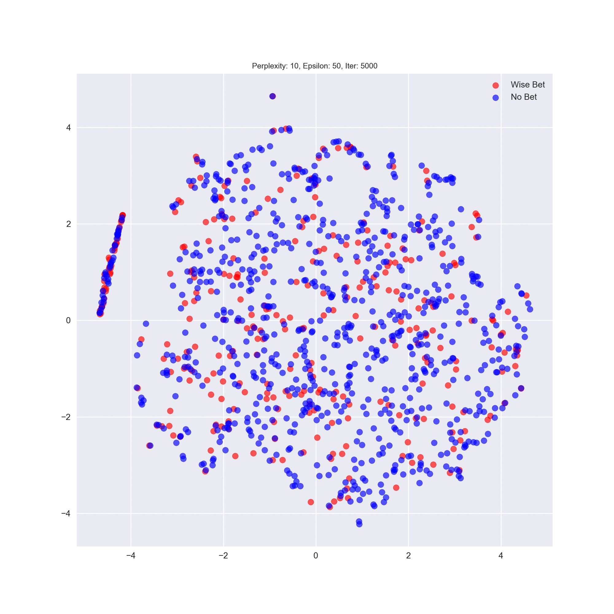  

#### t-SNE
A second dimensional reduction algorithm, or manifold learner, that is commonly used for visualization is t-distributed Stochastic Neighbor Embedding (t-SNE).  Unlike PCA, t-SNE doesn't provide a Rosetta Stone for translating data into its fundamental components.  Instead it seeks to find local groupings of one data point to its neighbors in high dimensions and visually represent them in lower dimensions, illuminating possible separability.  A progression of t-SNE results through increasing parameters for games labeled "wise bets" by the spread regression is to the right.

    

<b>Figure 6:</b> The results of increasing levels of perplexity for t-SNE dimension reduction on the Vegas
  spread bets. While there is eventual clustering, the classes never become linearly separable.

 

t-SNE's results might change slightly every time it is run, it is very sensitive to its parameters, and cannot be used for inference about unused, new data.  With proper tuning, however, it can reveal grouped relationships which might tell you if your data is actually separable.  Like PCA, t-SNE failed to reveal any underlying structure that could be separated.

 

#### Feature Overlaps
With no apparent real success in determining which games should be considered a wise bet by predicting the spread, I decided to take a quick glance at the primary [advanced metrics](#advanced-metrics) which routinely are designated the most important features in the model.  The hope is to see horizontal (x-axis) separation, showing that there are distinct means or groupings for the two classes in a given statistic.  As with PCA and t-SNE, the results were not encouraging as both classes occupy very similar regions of each feature.

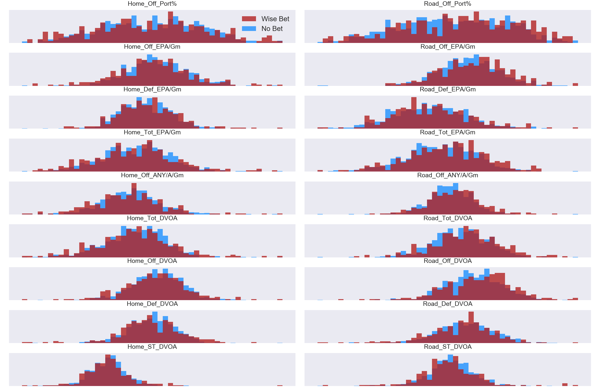

__Figure 7:__ The advanced metrics of DVOA, EPA, ANY/A, and PORT show very little horizontal separation for games that were labeled as a "wise bet" and those that weren't.  Ideally we would see a distribution of all blue and a separate one of all red beside it for a given metric.  Note: Axis tick labels are removed to help focus simply on bin separation, and the counts have been normalized since the raw count of "wise bet" games is a mere fraction of the total games.

#### Game Type Clusters
Unable to get any confirmation of class separability so far, I decided to cluster all matchups to see if there were distinct "types" of games.  After some trial and error, it became clear that there were basically four distinct types of NFL games.

1. Home team is much better overall.
2. Road team is much better overall.
3. Home team is much better on offense, road team much better on defense.
4. Road team is much better on offense, home team much better on defense.

Applying the t-SNE algorithm to these now-clustered games, we see that they are indeed distinct and (eventually) separable.  

__Figure 8:__ The t-SNE progressions for the clustered game types.  Initially separability looks uncertain, but as the perplexity increases we finally arrive at a dimensional reduction which shows four distinct classes. 

Again, we can only t-SNE we can only use the t-SNE to comment about the existing data and cannot mathematically make inferences about future data.  That said, seeing the classes separate out is quite nice, and in the rough shape of a football, no less.  My data has a sick sense of humor... it's been hiding something all along....

Jokes aside, this is one benefit of clustering.  We are grouping data by similar traits, so we expect it to be (more) separable.  One avenue we could take for further data analysis is to see how these four clusters relate to the predictions we make later in the project.  (This wasn't the focus of this project, so I have docked it under the [Future Considerations](#future-considerations) tab).  For example, if a home team is better offensively and the road team better defensively, does that tend to lead to a prediction of the home team winning more or less? Etc.

In closing, I must also clarify that the above class analyses were done on all three targets:
1. Predicting the spread to identify incorrectly valued games to bet on.
2. Predicting the over/under to identify incorrectly valued games to bet on.
3. Predicting the winner of a game outright.

The results were all comparable.  There is no clear class separability.  This does not mean a prediction model can't make good predictions, but it does imply that we should temper expectations.  It might still be possible to beat the existing Vegas baselines for these categories, but it appears that we won't be beating them by any massive margin.

 
 

## Results
As mentioned in [Wise Bets](#wise-bets) above, the goal of predicting the spread and the over/under was be able to label games that had improperly set lines which could make them appealing bets.  This means we really wanted to regress against these targets in order to ultimately classify them.  Paired with the three classification targets, this results in the final goal for all models in this project being able to classify whether or not a game is one we should bet on.  A quick glance at [Tables 3](#regression-outcomes) and [4](#classification-outcomes) show a fairly pedestrian success rate at correctly predicting two of the three classification targets and a modest but not insignificant error on the regression targets.  

 

### Spread Results
###### Spread Summary Statistics
Statistic | Mean (pts) | Std. Dev. | Coeff. of Var. | Min. (pts) | Max. (pts) | Min. Sigma | Max. Sigma
----------|:----------:|:---------:|:--------------:|:----------:|:----------:|:----------:|:--------:
Spread    |    2.58    | 5.89      |  2.28          | -23.0      | 26.5       |  -4.34     | 4.06     
Home MoV  |    2.87    | 14.6      |  5.07          | -46.0      | 59.0       |  -3.34     | 3.84   

__Table 5:__ Summary statistics showing the much wider spread of margin of victory, which is echoed in the rolling averages for each statistic.

 

#### Spread Accuracy
If we can predict the line accurately, we can identify games that are improperly valued by Vegas and choose to bet those games.  The best result obtained was a MAE of 2.32 points.  The spread average is 2.58 points with a standard deviation of 5.91 points.  (See [Table 5](#spread-summary-statistics).  Unfortunately this means that, on average, any prediction's true value can be within a window of 4.64 points -- not great.  

If we predicted a spread for the road team an upcoming game to be +1.0 point (meaning they were a 1-point underdog), which is the 8th most common out of 47 unique recorded lines, then using our average error, the "true" spread of the game might ought to be 1.0 - 2.32 = -1.32 points, or 1.0 + 2.32 = +3.32 points.  In the case of -1.32 points, the road team would now be favored and would likely cause us to change our bet.  Conversely, in the case of +3.32 points, the home team would now be favored by _over_ a field goal, which is the easiest score to make in football and would likely change our bet.  

With this in mind, I decided to set the threshold for deciding how far off a game's spread was to a minimum +/- 3 points.  This ensured we would not select games that would 'flip' the favored team and that our prediction would be beyond the threshold of a field goal. Games that met or exceeded this threshold are explored in the [Wise Bets Results](#wise-bets-results) section below.

#### Spread Feature Importance
The most important features tend to be the _matchup delta_ features I engineered.  These tell the difference between the two teams in a game in a given metric.  My reasoning was that the raw value, say a high amount of rushing yards per game, would matter little for prediction of one team's superiority if the other team also had a high value in that metric.  If one team was significantly better than the other team in a given metric we would be able to make more accurate predictions.  This finding is shown consistently in this project as the _matchup_ features rank high in importance.

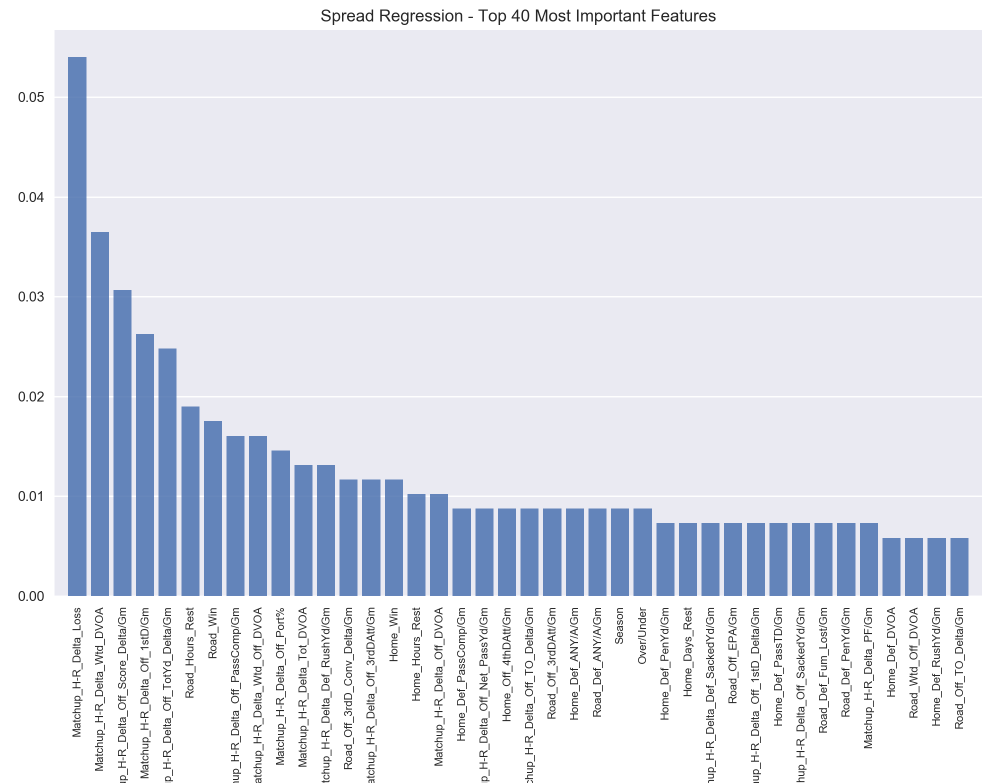

__Figure 9:__ The 40 most important features in predicting the spread are dominated by the _matchup_ features, including ten of the first twelve.  After the first 15 features, relative importance begins to level off with larger groupings of equally important features. 

 

#### Spread Analysis
The most important statistic is simply the difference in losses between the teams.  This isn't surprising, as the general public is going to base much of their betting on which team has a better record.  Much of the rest of the features are dominated by the [advanced metrics](#advanced-metrics), with _weighted DVOA_ (a measure of how well a team has been playing recently) being the second biggest predictor.  The first non-_matchup_ feature is simply the number of 3rd down conversions the visiting team is averaging per game.  The more 3rd downs a team converts, the more they extend their drives and the more likely those drives are to yield points.   

Apart from these metrics, it is interesting to see _hours of rest_ be so statistically significant.  Vegas is clearly factoring in how long it has been since a team last played into its formula when setting a spread.  The _season_ in which a game is played also has an impact on the spread, which surprised me.  So, I took a look at the spread with regard to change over time.

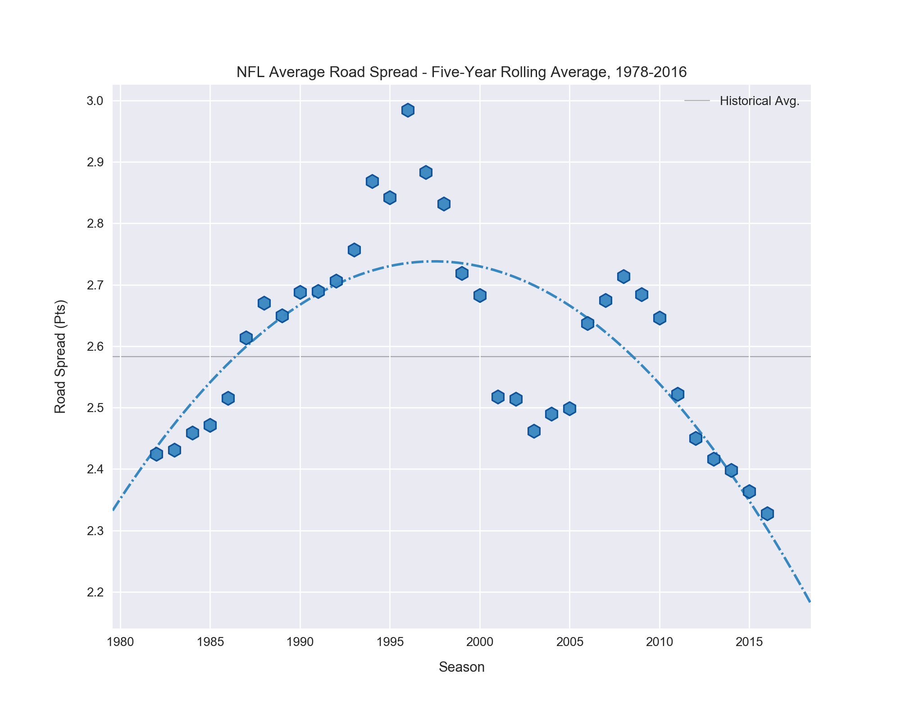

__Figure 10:__ The spread has changed measurably over time.  The rolling average was computed with a window of four years and a second order polynomial fit line.

 

I was unsure if the observed change is due to Vegas becoming better at prediction and improving their formulae, or if it reflects a change in the league itself, where home teams were more successful in the mid-1990s.  So -- you guessed it -- I decided to look at the historical averages for home team _margin of victory_.  

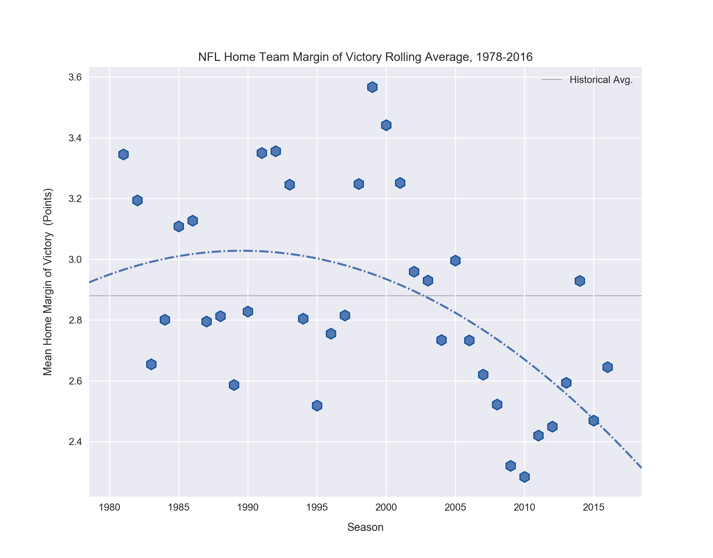

__Figure 11:__ The average margin of victory for home teams isn't smoothed very well with a four year rolling average window.  Its trend mirrors that of the Vegas spread overall, but has pronounced differences in any given year.

 

We see that overall, the trends follow the same general path of peaking in the early- to mid-1990s and falling thereafter.  But a year-by-year inspection shows significant discrepancies.  Take 1995, for example.  It was the season of the lowest average home margin of victory for 30 years, but that year and the one after both saw Vegas _increase_ the average spread in favor of the home teams!  In general I suspect the average margin of victory has too much variance for Vegas to react with knee-jerk spread dampening or inflating.  While margin of victory trends over time are informative, they are clearly not the sole explanation for the changes with time in the average spread.  We can see the summary statistics in [Table 5](#spread-summary-statistics) back up what the graphs above show us.

 
 

### Over-Under Results
###### Over/Under Summary Statistics
Statistic | Mean (pts) | Std. Dev. | Coeff. of Var. | Min (pts) | Max (pts) | Min Sigma | Max Sigma
----------|:----------:|:---------:|:--------------:|:---------:|:---------:|:---------:|:-------:|
Over/Under |    41.6   | 4.58      |  0.11          | 28.0      | 63.0      | -2.97     | 4.67    |

__Table 6:__ Summary statistics showing the much wider spread of margin of victory, which is echoed in the rolling averages for each statistic.

 

#### Over-Under Accuracy
Predicting the Over/Under is a bit easier for the model, as the data is more tightly clustered around its mean than the Vegas Spread. (See [Table 6](#over/under-summary-statistics)).  The lowest MAE for predicting the Over/Under was 1.86 points.  As with the spread, if we consider the range this gives us for prediction, we have a 3.72-point window.  However, unlike the spread, where a scoring play can be good (if made by the team we've bet on) or bad (if made by their opponent), all scoring plays for an Over/Under bet are either good (if we bet the Over) or bad (if we bet the Under).  

This allows us to use the 1.86-point MAE as our error instead of the 3.72 window.  If the real Over/Under is 43.0 points and our predicted Over/Under is 44.0 points, and we choose the Over, we are not worried about the +1.86-point error in prediction since we are already expecting more than 44 points to be scored. So 44.0 + 1.86 = 45.86 points for the upper bound of prediction is actually _better_ for us, since this says the game should go even further over. The reverse is true for betting the Under.

By far the most obtainable scoring play in football is the field goal, which is worth three points.  As such, it reasons any predicted Over/Under that is +/- more than three points different than the actual Over/Under should be considered a potential "[wise bet](#wise-bets)". If it is beyond this threshold with the error taken into account, even better. See [Wise Bets Results](#wise-bets-results) below.

#### Over-Under Feature Importance
Unsurprisingly the most important features for determining the combined points scored in a game are statistics that relate to how effective a team is at scoring or preventing a score.  We see a strong divergence from important features in predicting the spread, with no _matchup delta_ metrics present.  This fits common sense as we aren't concerned with how much better Team A is than Team B at something, but rather how good or bad both teams combined are.  

###### Over-Under Top Features
Rank | Statistic         | Importance (%) | Rank | Statistic          | Importance (%)
-----|-------------------|:--------------:|------|--------------------|:-------------:
1    | Home Pts For/Gm   | 6.10           |  9   | Temperature        | 1.89
2    | Road Pts For/Gm   | 5.81           |  10  | Wind (mph)         | 1.74
3    | Season            | 4.64           |  11  | Road Off PassTD/Gm | 1.60
4    | Home Pts Allow/Gm | 3.48           |  12  | Road Wtd. Def DVOA | 1.60
5    | Road Pts Allow/Gm | 3.34           |  13  | Road Def TotYd/Gm  | 1.45
6    | Road Off TotYd/Gm | 3.05           |  14  | Home Off TotYd/Gm  | 1.45
7    | Home Def TotYd/Gm | 2.18           |  15  | Road Off PassYd/Gm | 1.31
8    | Wind Chill        | 1.89           |  16  | Roof Dome          | 1.31

__Table 7:__ Top 16 features for predicting the Over/Under show many stats related to scoring and yardage, but also surprisingly temperature, wind, and whether or not the game is played in a dome.

 

#### Over-Under Analysis
The Over/Under has been climbing since the year 2000.  Initially the change was incremental, but over the last decade the Over/Under has exploded, setting a new record five-year average for ten of the last eleven years!  I explore some possible causes for this growth below, starting with features that had the biggest impact on predicting the Over/Under.

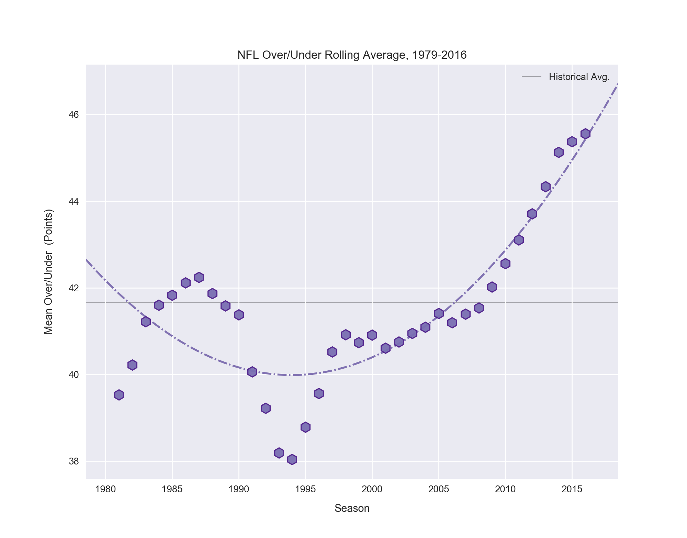

__Figures 12:__ The Over/Under has been on an upward climb since 2000, and has especially skyrocketed the last ten years.

 

Looking at [Table 7](#over-under-top-features), the two most important statistics are the two we'd hope to see: how many points each team scores per game.  Following that is a surprising result -- the season!  This sparked me to investigate the Over/Under change over time as I did with the spread above.  It is examined below.  The remainder of the important statistics can be categorized as either "team related" or "game related".  The team-related statistics are sensible, related to how many points allowed and yards teams average.  But the game-related features are interesting and worth a quick word.

Wind chill and temperature only differ below 50° F, so seeing them paired is partly a consequence of their having the same information for all temps above 50° F.  I think there is also a relationship between the weather variables and the roof variables.  First, a quick graphical glance, then my thoughts below.

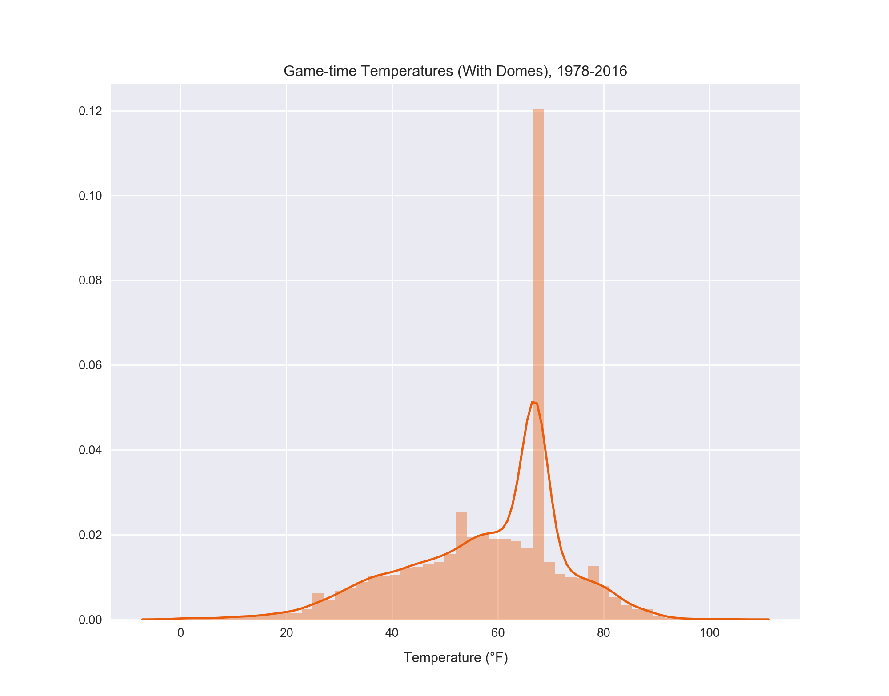

__Figure 13:__ The distribution of game-time temperatures from 1978-2016 show an expected distribution, except for the occurrence of dome games which spikes the count for 67 °F.

 

The poignant aspect of the temperature charts is the towering prevalence of games at 67 °F, the temperature of games in played in a dome.  (See [Acquisition and Error Correction](#acquisition-and-error-correction) for details on this).  Around 21% of all games played from 1978-2016, but these aren't equally distributed across that time span.  Domes have become increasingly popular in recent years.  Because of this, I wondered if there was a possible connection between the increase in games played in domes and the increase in the Over/Under.  Behold!

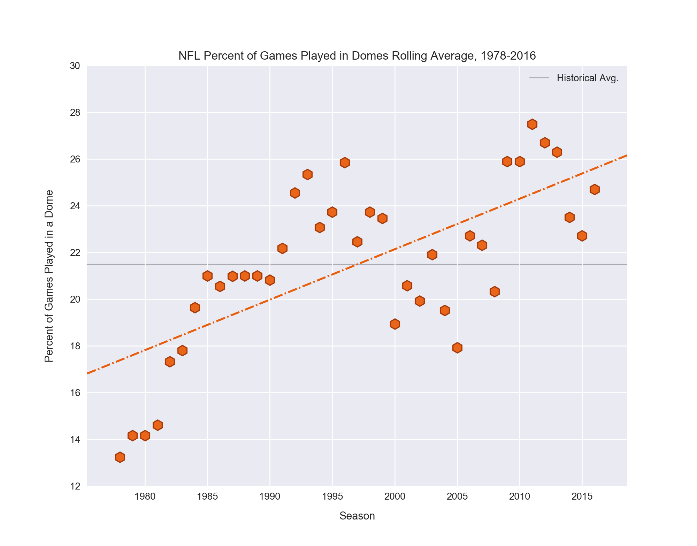

__Figures 14:__ The trend in percent of games played in a dome is clear: more, more, more.  This trend also mirrors the increase in Over/Unders set by Vegas.

 

Though I am unsure of the cause of the slight dip in the mid-200s (it's possibly due to temporary outdoor stadia being used while newer, domed stadia were being built), the overall trend of an increased percent of games being played in domes is obvious.  Currently one-quarter of the league's stadia are either domed or have retractable roofs.  Once the forthcoming Las Vegas Raiders finish building their new stadium in Nevada, nine of thirty-two teams will have the potential for a roofed stadium. [__6__](#fn6)

Considering this impact on the Over/Under, recall that feature importance only tells us if having either _more_ or _less_ of the given feature increases the prediction of the model, not which one. With this in mind, I propose the following explanation for the apparent value of the weather-related and dome features in predicting the Over/Under: in the NFL, successfully passing the football is the catalyst for consistent scoring. [__7__](#fn7) Extreme weather (very high/low temperature, very windy, rain, snow) adversely affects the passing game more than the rushing game.  In a rainy game, for example, teams will run much more than pass because the ball is slippery, making it both hard to throw and to catch.  This decrease in passing will lead to a decrease in combined scoring.  

But there's no bad weather in a dome.  So, the increase in domes means an increase in the number of games that are guaranteed to have good conditions, and a decrease in the number of games which can have bad ones.  With this reasoning, more dome games should equal more scoring.  There are also a handful of factors which influence the rise of domes, including the ability to draw fans on bad weather days, as well as what might be perceived as a competitive advantage for the home team by gearing their offense to more finesse passing (debatable).  Regardless of origin, the larger trend between increased number of dome games parallels the increase in the Over/Under set by Vegas.  

While the relationship between an increased number of dome games and the increased Over/Under makes sense and is worth further investigation, there are other reasons which have undoubtedly contributed more to the increase in Over/Under values, primarily the increase in league-wide passing rate and efficiency [__7__](#fn7), as well as what are perceived to be more "pro-offense" rule changes in the last fifteen years.  With this in mind, I took a quick look at how offense has changed in the NFL over time.  

###### Passing vs Rushing Offense Over Time
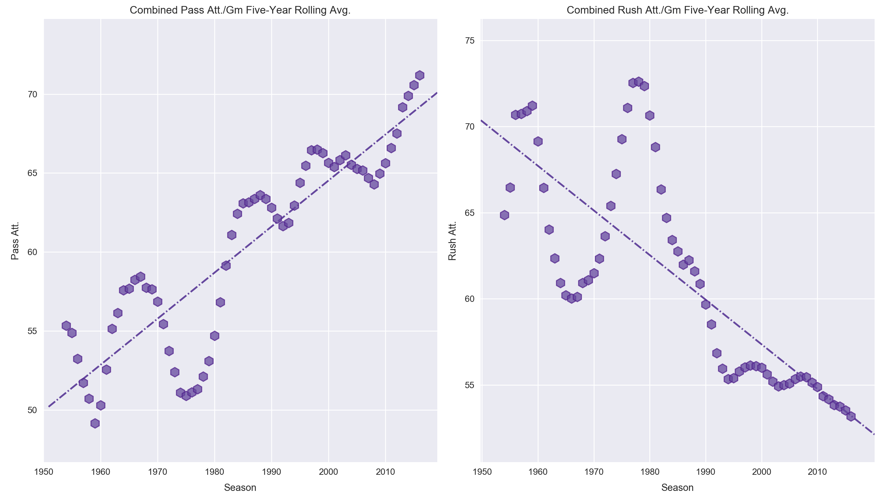

__Figures 15:__ Five-year rolling averages of Passing attempts (left), which has grown at an alarming rate over the last decade-plus, and rushing attempts (right), which dropped precipitously two decades ago and has somewhat stabilized since, 1950-2016.

 

These two rolling average plots of passing offense (left) and rushing offense (right) since 1950 show starkly different trends in league-wide offensive approach.  During the 1960s the high-flying AFL seems to have bolstered passing game, but was promptly suppressed once the leagues merged in 1970.  In 1978 and 1979 major rule changes were implemented that made pass defense more difficult, causing the first initial rise in passing offense.  To my surprise, it leveled off and remained consistent for the remainder of the 1980s and 1990s.  Beginning in 2005, however, the league began to experience its own Cambrian explosion of passing attacks, growing each year for a decade straight.  Conversely, rushing offense plummeted for fifteen consecutive years before coming to a roughly stable resting point.   

As interesting as the topic of how the league changes schematically as a whole over time is, the point of this investigation was to see if we could explain the dramatic rise in Over/Unders.  I think its safe to say we can do so to a large degree with passing offense alone, as we predicted above.  Take a minute to compare [Figure 12](#over---under-analysis) and [Figure 15](#passing-vs-rushing-offense-over-time).  The sharp rise in passing offense parallels that in the Over/Under, while rushing offense seems to have little to no correlation.  When comparing multiple variables at a time, a scatter matrix can help illuminate trends between all combinations of the targets.

###### Offense and Over-Under Scatter Matrix
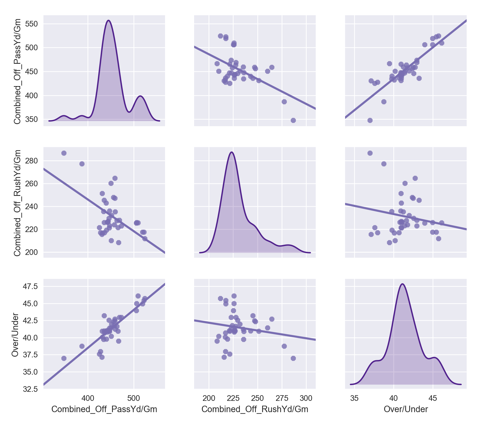

__Figure 16:__ Scatter matrix of five-year rolling average passing offense, rushing offense, and the Over/Under per season since 1978.  Passing offense is clearly positively correlated with the Over/Under, while rushing offense has almost no observed correlation.

 

At a glance we can see evidence of what we suspected above -- passing offense is strongly and positively correlated with the Over/Under, while rushing offense apparently bears no correlation to it.  Recall the Over/Under is simply the combined total points in a game, and as mentioned above, passing efficiency is the primary means to offensive success and higher scoring (see [Brian Burke's article](https://fifthdown.blogs.nytimes.com/2010/08/31/why-passing-is-more-important-than-running-in-the-n-f-l/) about passing offense efficiency which was written in 2010, right as the furious growth in passing offense began.  His claims would be only more concrete and emphasized if the article were written today).  The data here only bolster this conclusion: more passing means more scoring, all things equal.  But if _everyone_ is better at passing league-wide, then would it not competitively cancel out for everyone?  This question -- which statistics correlate to actually _winning_ -- is one we'll explore a bit more in the next section, where we analyze the Vegas money line.

 
 

### Money Line Results
As noted above in the [NFL Betting Primer](#nfl-betting-primer) section, the money line is merely the odds of Team A beating Team B.  As you might expect, the odds of Team A beating Team B dovetail very nicely with the spread, which is a measure in points (not odds) of how much better Vegas believes Team A is than Team B.  In fact, the two are so closely linked that they are for practical purposes equivalent in significance.  The R2 correlation between a game's spread and its money line is __0.975__!  

###### Spread and Money Line Linear Relationship
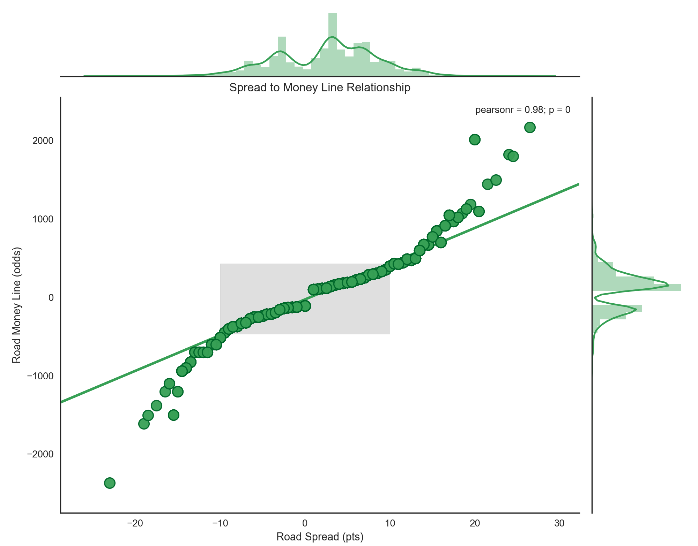

__Figure 17:__ The relationship between the spread and moneyline looks to be perfectly described by a 3rd degree polynomial (not pictured), but a closer look at the _density_ of the spread values, shows that over 94.51% are concentrated between -10 and +10.  This range comprises the center of this plot, which is highlighted with a grey box, and is easily described by a linear regression.

 

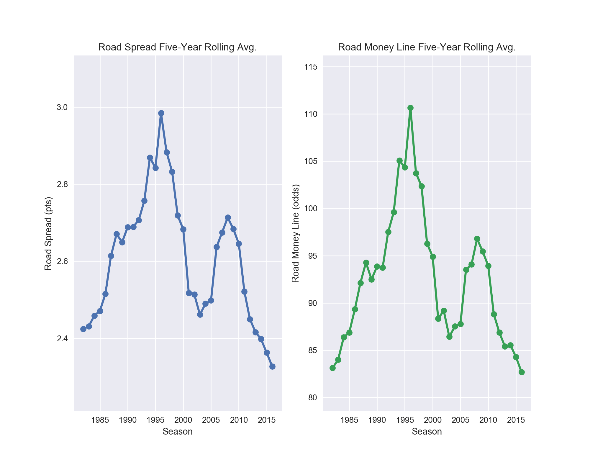

###### Spread and Money Line Rolling Average
The point to take home is that the spread and the money line are essentially two ways to report the same metric -- how much better one team is than another.  Because of this, regressing against the money line is essentially the same as regressing against the spread.  Results are nearly identical in both feature importance and accuracy, as expected.  As a result, no further testing or modeling was done on the money line.  The remainder of the project was focused on examining how well the results of games labeled "wise bets" turned out.

 

<b>Figure 18:</b> Further illustrating the near-identical relationship between the spread and the money
 
line is their five-year rolling averages which appear as nearly carbon copies of each other.

 
 
 

### Predicting Bet Outcomes
#### Covers and Over/Unders
Two of the three classification targets, _road covers_ and _over/under results_ proved to be very difficult to tease anything meaningful out of.  My first hunch is that this is due mostly to what the classes are derived from: betting lines set by Vegas.  As discussed in the [NFL Betting Primer](#nfl-betting-primer) section, Vegas has a vested interest in making the results of any bet as close to 50/50 as possible, in order to avoid suffering massive losses.  Vegas takes small wins many times over to turn large profits.  

Since the spread and over/under are set by Vegas to meet this balanced criterion, it is not surprising to find that "hidden gem" metrics which predict the results of these bets were not discovered.  If something does a great job of predicting these results, then Vegas knows about them already -- this is their livelihood, after all -- and is using them in their formulae to set these values.  In a sense, we are merely trying to tease out something Vegas has already baked in.

The results for predicting these two bets never got much above 51%.  Remembering that the initial motivation of this project was to build a model to predict the spread, identify games that were beyond a spread-deviation threshold, and investigate to see if they were truly "wise bets".  As you can likely guess, the results for this approach were sub-optimal.  That does not make them uninteresting, however, and they are discussed below in the [Wise Bets Results](#wise-bets-results) section.

 

### Predicting The Winner
###### Winner Summary Statistics
Statistic     | Mean (pts) | Std. Dev. | Min (abs) (pts) | Max (abs) (pts) | Min Sigma | Max Sigma
--------------|:----------:|:---------:|:---------------:|:---------------:|:---------:|:--------:|
Home Team Win |    12.5    | 9.65      | 1.0             | 59.0            | -2.97     | 4.67     |
Home Team Loss|   -10.5    | 8.50      | 1.0             | 46.0            | -1.36     | 6.64     |

__Table 8:__ Summary statistics showing the much wider spread of margin of victory, which is echoed in the rolling averages for each statistic.  There were only twenty ties in 9064 games (0.22%) from 1978-2016 and nine such games from 1994-2016.  As such, ties have been omitted. 

 

Recall from [Table 2](#class-ratios) that the lone imbalanced class was the _Home Team Win_ class, which is simply a binary class of "yes" or "no" results depending on if the home team won ("yes") or lost ("no").  Also recall that of the 5498 games used in this model, home teams win at a 58% rate over time, meaning the class is 58% 'yes' and 42% 'no'.   Methods of addressing this moderate imbalance were discussed in the [Classification](#classification) section as well.  Ultimately I decided to use the _advanced_ database and to not use SMOTE oversampling for class psuedo-balancing.  

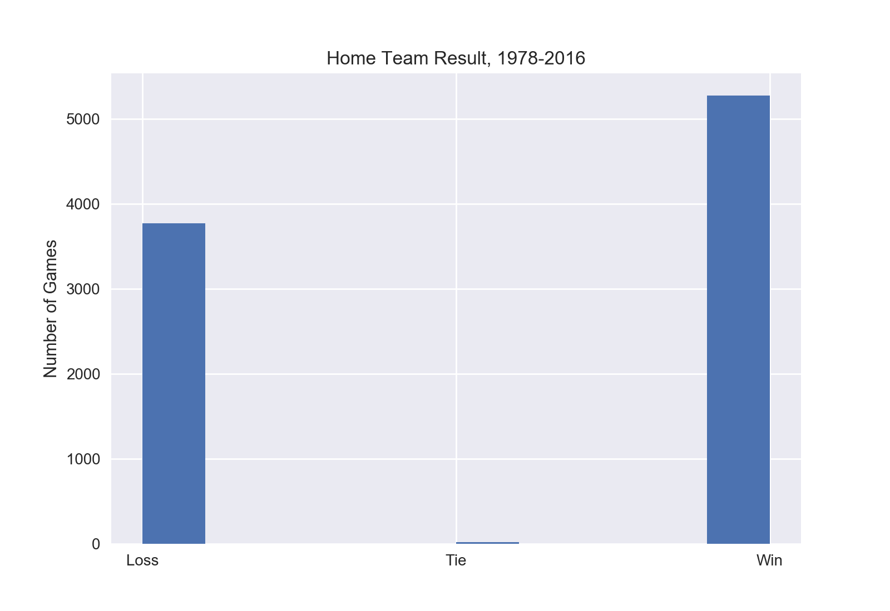

__Figure 19:__ Histogram for games won by the home team vs. by the road team.  Ties are so rare they barely show up.  This plot shows the classes suffer from imbalance, but not severely so.

While using SMOTE did slightly improve the _Home Team Win_ predictions, I didn't like the idea of 'artificial' games being used in the database because it made extrapolating results to the actual games that occurred more difficult.  The idea of having 'false' games included if I were to use a plot detailing the breakdown of how a specific metric impacts the chances of a team winning was unappealing.  If I decided to use only the 'true' games, would the trends match up to what was claimed by the SMOTE-driven results?  Having the luxury of a Gradient Boosted Classifier that handled the 'imbalanced' classes rather well (as noted in [Table 4](#classification-outcomes)) made the decision easier, admittedly.  

 

#### Winner Accuracy
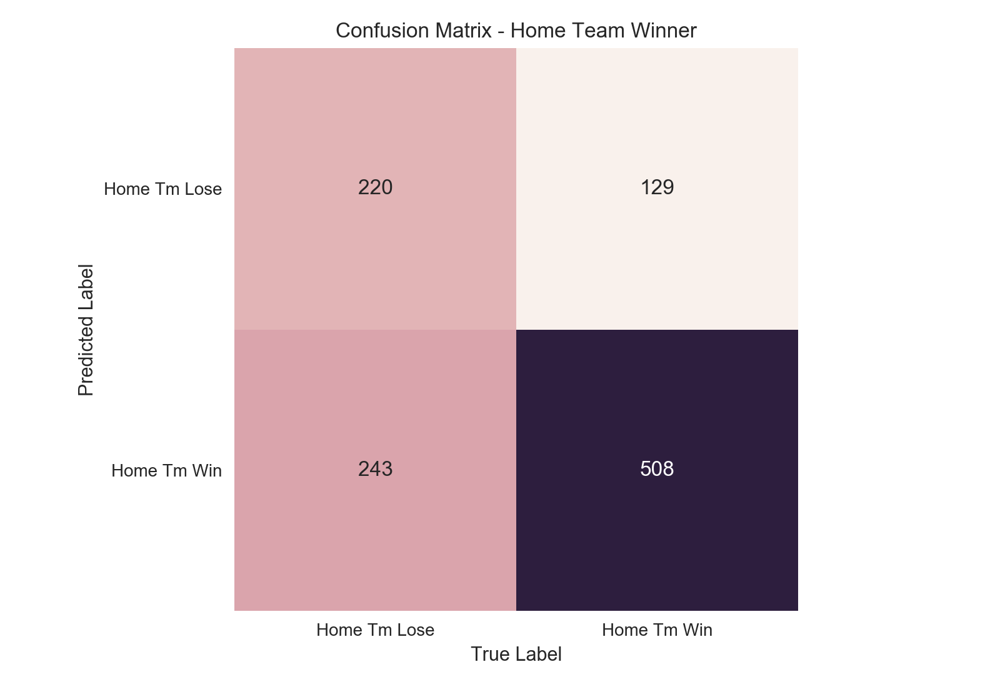

When our model makes a prediction that the home team won a game it has labeled the game as a "positive" (e.g. "yes").  If the game it labeled as a positive actually was won by the home team, the prediction would then be considered a "true positive".  However, if the home team lost a game predicted by the model to have been a home victory, it would have incorrectly labeled the game as a positive, resulting in a "false positive."  The same concept applies to predictions labeled "negative" as well.  

 

<b>Figure 20:</b> A confusion matrix of predictions for classifying games won by the home team.   The model errs on the side of naming more games are home wins than actually are.

 

No model will get every prediction right (in the real world), so we need a way to measure how accurate and reliable our model is.  One method is the confusion matrix for our predictions.  A confusion matrix allows us to see how accurate our model is by showing us the counts of our true positives, true negatives, as well as our false positives and false negatives.  It gives a great cursory look at how our model is handling prediction.  Ideally the matrix would have predictions tallied only in its diagonal, where all "negative" data points were labeled "negative" and "positive" points labeled "positive" by the model.  Despite, or rather because of, its simplicity, the confusion matrix offers only a glimpse at how well the model is predicting at a single threshold of confidence.  Another method of classification evaluation which allows us to obtain a "big picture" view of model performance is the ROC curve.

 

###### Receiver Operating Characteristic
Developed during World War II by the British, the ROC curve tells us the ratio of the true positive _rate_ (TPR) to false positive _rate_ (FPR) our model is predicting.  _Rate_ is an important word, here.  The ROC curve doesn't tell us the raw _counts_, which is perhaps the first assumption for someone new to the concept.  Instead, the ROC curve tells us what percent of the positive class in the dataset we correctly identified as positive (our true positive rate, also known as "recall" or "sensitivity") and conversely what percent of the negative class we incorrectly labeled as positive.  

An example is instructive.  Pretend our dataset has ten games, eight are "home team wins" (positive class) and two are "home team loses" (negative class).  Our model makes a prediction for each of these ten games with a certain degree of confidence.  For example, the model might feel 75% confident that game one is a "home team wins" game, but only 15% confident that game eight is as well (which means the model is actually 85% confident game eight is a "home team loses" outcome).  The ROC curve shows us how accurate our model is at increasing thresholds of confidence in classifying a game as "home team win".

At a threshold level of 0% confidence, we are saying _every_ game should be a "home team wins" because we require no threshold to meet this classification.  As such, every actual "home win" in the database will be labeled as a "home win" by the model, giving us 100% true positive rate. (Yay us).  However, since we labeled _every_ game a "home win", this means we also labeled all the "home loss" games as "home wins," which means our false positive rate is also 100% (Not yay us).  As we escalate our threshold level, only games that are at or above the given threshold will be considered a "home win", all the way up to a 100% threshold, at which point no game is good enough to be classified as a "home win" (we can never be _100%_ positive of a prediction unless the game has already occurred), and our rates for both true and false positives are 0%.  

So, of the ten games in our example dataset, let's say the first two are "home losses" and the remaining eight are "home wins". (This would be represented as `[0, 0, 1, 1, 1, 1, 1, 1, 1, 1]` in our model, equaling `[loss, loss, win, win, win, win, win, win, win, win]`.  Note, the model does _not_ know the answers which we have just seen.  All it sees is `[game 1, game 2, game 3, ..., game 10]`.  Each result is a mystery to it, hence the need to predict.  This is a very "duh" fact, but bears repeating in this explanatory example). Let's also say that our model says the first five games are assigned a 30% confidence of being a home win and the final five games are given an 80% confidence of being a home win.  For clarity, our game set would look like this (actual result in parentheses):  [__30%__ (loss), __30%__ (loss), __30%__ (win), __30%__ (win), __30%__ (win), __80%__ (win), __80%__ (win), __80%__ (win), __80%__ (win), __80%__ (win)].  

If we set our threshold for "home win" acceptance at 50%, then all games listed below 50% would be labeled "home loss" and all games above would be labeled a "home win."  Our resulting predictions in this case would be as follows: [__loss__ (loss), __loss__ (loss), __loss__ (win), __loss__ (win), __loss__ (win), __win__ (win), __win__ (win), __win__ (win), __win__ (win), __win__ (win)].  So we have now five of the eight games that were actual wins predicted as wins.  Our __TPR is 5/8 = 62.5%__.  And we have neither of the games that were actually losses predicted as wins.  Our __FPR is 0/2 = 0.0%__.  Thus, we can say at the 50% threshold, our model has a TPR of 62.5% and an FPR of 0.0%.  (This would be an exceptionally great model and is an unreasonably high ratio for any real-world situation).

We measure our TPR and FPR for every threshold of 'confidence' in the prediction, from 0% to 100% confident.  The ratio changes as the threshold changes, and we plot these changes to form a ROC curve.  Random guessing would equate to a 50/50 split of true positives to false positives for a binary classifier, so this is our baseline.  Anything below that is worse than random chance.  The higher the true positive rate at a given threshold, the better the model.  When wanting to evaluate the model _as a whole_, we use the area under the curve (AUC).  This value tells us how the classifier performs over its entire range of operation.  As in model tuning, we use a split subsample, or fold, of the data to test how well it performs on each split and average them together.  Here is this model's ROC curve for predicting whether the home team wins a game.

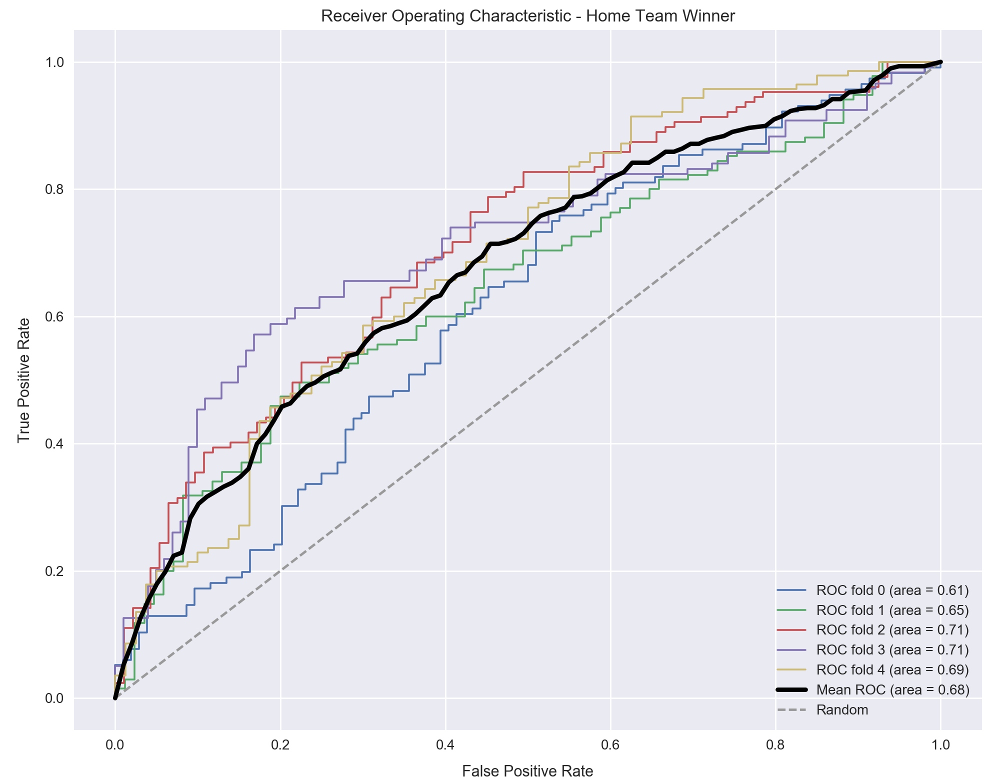

__Figure 21:__ The ROC curve for predicting if the home team will win.  Some deviation is present between each fold of data.  The _threshold_ level for each prediction is ideally 1-FPR.  So, at the FPR of 0.6, the threshold for our predictions is 0.40, or 40%.  This means the bottom left corner represents the un-achievable 100% confidence level (no data point is good enough to be classified as the "positive" class), while the top right corner represents the opposite, a 0% confidence level (every data point is classified as "positive").

 

An AUC of 0.68 is appreciable for the challenging task of identifying the winner of a game.  But as seen in [Figure 21](#receiver-operating-characteristic), the ROC curve lets us choose a single threshold value for comparison.  Depending on the question we are trying to answer, we might have a strong preference for a higher or lower threshold.  The canonical example is cancer detection, where we would want a fairly low threshold to label a patient as "positive" for cancer.  A low threshold means we will have more cases that are labeled as "positive," both true and false, and fewer total negatives conversely.  

We can tolerate more false positives because a cancer diagnosis comes with extensive follow up appointments to both confirm the diagnosis and plan treatment if a growth is malignant.  These will weed out the false positives.  But a false negative is a critical error that sends a patient home thinking they're healthy when in reality they've cancerous tumors.  Since this is the result we most want to avoid, we choose a threshold that optimizes our ROC score at a low threshold.  

Our goal in this particular task is to identify which team will win the game ahead of time so we can place a bet on that team.  While there are various strategies to betting, it's safe to say that on average we would prioritize a high degree of certainty in our prediction at the expense of missing out on some potential winners.  We aren't going to be all sixteen NFL games each week.  Besides being cost-prohibitive, most games will be too close a matchup to predict well.  Instead, we will ideally bet only one or two that we are most confident about.  The actual success rates of given thresholds is discussed below in [Prediction Confidence](#prediction_confidence), but for the ROC curve, we would probably try to pick the optimum point that is at a 75% threshold or greater.  In this case, that would be at FPR = 0.20 to 0.25.  This is arbitrary and depends on the bettor's personal requirements.  A deeper look at the actual success rate of bets for a given confidence level is explored below in the [Prediction Confidence](#prediction-confidence) section.

 

#### Winner Feature Importance
Perhaps the best evidence that Vegas "knows what they're doing" is this ranking of feature importances.  The Vegas spread is easily the most decisive statistic that found in predicting who will win a game.  Including dummied variables, there were around 345 total features included in this model.  For one to be roughly four times more important than any of the other 344 is telling.  Overall there are really five tiers to the top forty features:
1. The spread: 11.66%
2. Features 2-4: >2.0%
3. Features 5-8: 1.53%
4. Features 9-18: 1.23%
5. Features 19-39: 0.92%

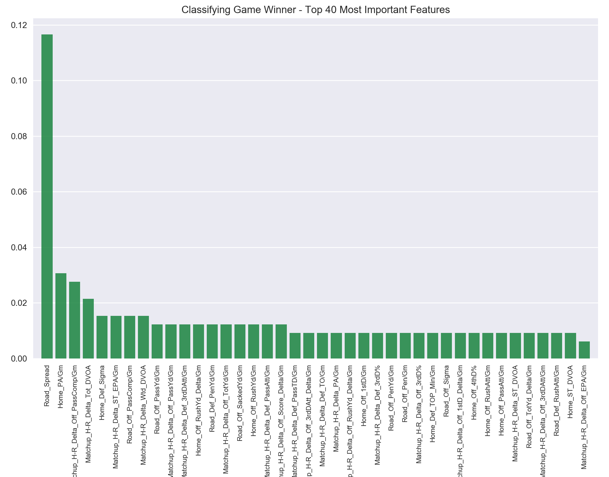

__Figure 22:__ The 40 most important features in predicting the game's winner.  The spread for the game is the easy winner.

 

#### Winner Analysis
The predictive power of the spread in determining who will win an NFL game is worthy of further discussion below.  Before that, let's take a quick look at the other features which give insight into a game's winner.  While the old adage "defense wins championships" often feels trite and cliched, it might hold some statistical water as two defense-related metrics are the second (_points allowed per game_) and fifth (_defensive sigma above average_) most important features.  This topic warrants an entire project all its own, but the fact that even with competing against the entire litany of advanced metrics, _points allowed per game_ by the home team is the most predictive non-Vegas statistic for determining if the home team will win a game can't be discounted.  

Perhaps unsurprisingly, the _difference in average passes completed per game_ is the third biggest predictor and passing-specific stats appear eight times in the top 40 features (see [Table 9](#passing-features)).  Echoing what was discussed in the [Passing vs Rushing Offense](#passing-vs-rushing-offense-over-time) section above, when one team is more proficient at passing than their opponent, they are more likely to win.  

###### Passing Features in Top 40
Statistic                          | Tier | Importance (%)
-----------------------------------|------|---------------
Difference in Pass Comp. / Gm      | 2    | 2.76%
Pass Comp. / Gm                    | 3    | 1.53%
Pass Yards / Gm                    | 4    | 1.23%
Difference in Pass Yards / Gm      | 4    | 1.23%
Yards Lost to Sacks / Gm           | 4    | 1.23%
Difference in Pass Att. / Gm       | 4    | 1.23%
Difference in Pass TD Allowed / Gm | 5    | 0.92%
Pass Att. / Gm                     | 5    | 0.92%

__Table 9:__ The eight passing-related statistics that appear in the top 40 features for predicting a game's winner.

 

###### Rushing and Winning
Other features that help predict whether a team will win or not read like a list of the usual suspects: superiority in advanced metrics like [DVOA](#advanced-metrics) and [EPA](#advanced-metrics), rushing stats per game, penalties and penalty yards per game, and 3rd and 4th down efficiency.  _Time of possession_ clocks in at \#29.  _Time of possession_ and the various _rushing_ stats (five total in the top 40 but none before tier 4) offer a textbook case of the "chicken and the egg" conundrum, however.  At first glance it is tempting to simply say "teams that have the ball more and have more rushing attempts per game win more."  Statistically, yes, our model says that is true.  

But we must think about it one level deeper.  Doing so, we realize that teams which are leading _overwhelmingly_ run the ball more than teams that are trailing (Chase Stuart’s easily digestible “[game scripts](http://www.footballperspective.com/introducing-game-scripts-part-i/)” metric does a good job of capturing this).  As a result, teams that are trailing face far more rushes and subsequently give up more yards.  So, in a way the model is likely picking up that teams that allow more rushing yards than others are frequently trailing... and when you’re frequently trailing you are going to lose more often than win.  The fallacy (known in the stats community as the [“establish the run”](http://www.footballoutsiders.com/stat-analysis/2003/establishment-clause) fallacy, popularized by Aaron Schatz at Football Outsiders back in 2003 [__8__](#fn8)) that so many jabbering heads on TV espouse of “run the ball to win!” is actually the inverse of what happens, and I suspect this is what the model also detects.  It’s the teams that are already winning which choose to run the ball, not vice versa.  [Figures 23](#time-of-possession-and-rushing-attempts) and [667](#passing=and-rushing-attempts-correlation-to-margin-of-victory)

###### Time of Possession and Rushing Attempts
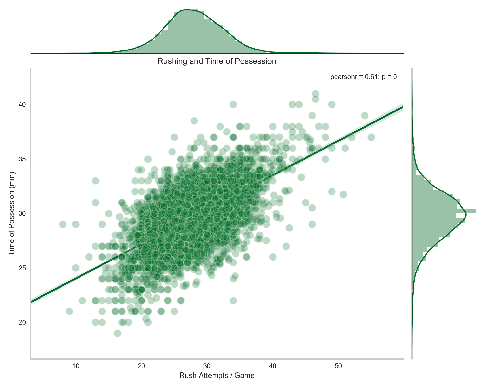

__Figure 23:__ The correlation of increased time of possession with increased rushing attempts, 1978-2016.

 

The relationship between rushing attempts and time of possession is stark but sensible.  The clock is stopped after every incomplete pass or after a player steps out of bounds, which also happens more often after a pass play.  It continues running after a player is tackled in the field of play, which is the result of the vast majority of rushing plays.  When you're leading in the game, especially in the second half, you want to "shorten" the game by using a much time per play as possible.  This regression plot shows what both we and coaches intuitively know: running the ball is directly tied to draining the play clock.  The same correlation between number of passing attempts and time of possession yields a piddling R2 value of __.044__, which is essentially zero.    

 

###### Passing and Rushing Attempts Correlation to Margin of Victory
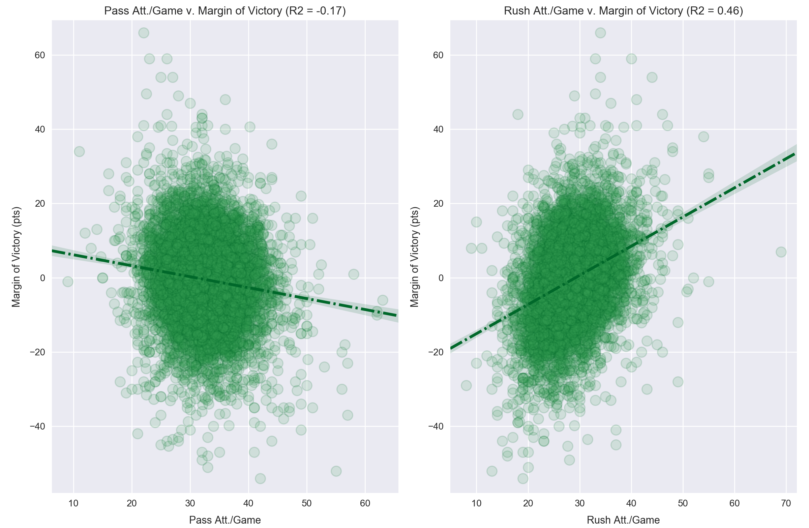

__Figure 24:__ The relationship between average number of passing attempts and rushing attempts with average margin of victory, 1978-2016.

 

A second look at the concept of "rushing because we're winning" is to see how the number of rushing attempts correlates to average margin of victory.  There is a distinct positive relationship, while the same regression for number of passing attempts is actually slightly negative.  The old adage "correlation is not causation" applies here.  Someone uninterested in the underlying mechanics of the relationship, or nearly every sports TV talking head, would take one glance and conclude that the secret to winning more games is simply to run the ball more.  But as discussed above in the [Rushing and Winning](#rushing-and-winning) section, the inverse of this is actually true.  

Properly understood from this context, [Figure 24](#passing=and-rushing-attempts-correlation-to-margin-of-victory) shows that the bigger a team's lead, the more they're going to run the ball.  Conversely, teams that are trailing have to pass to catch up.  Again, as mentioned above, on average passing using less of the clock per play than rushing, and also covers more yardage.  Thus, we see the negative relationship of "bigger deficit correlates with more passing."

###### Turnovers
Turnovers appear in tier 5 with _difference in average turnovers caused per game_.  This is a tough one.  We know that in any game turnovers are massively important.  They directly rob one team of a possession and gift one to the other (usually with advantageous field position).  This model doesn’t see a team's average turnover rate as being supremely __predictive__ because they are in some degree unpredictable.  Team A may be averaging 2.2 turnovers per game and Team B may average 1.8, but they might fluctuate a good deal between games (high).  These differences don’t appear to be extremely predictive (about as predictive as the difference in 1st downs per team, penalties per team, or passing yards per team).  

I broke the category down into fumbles, fumbles lost, interceptions, and total turnovers, and the model identified "total turnovers" as the most important of the lot.  My personal conclusion is that the nature of turnovers is largely so random that they aren’t necessarily replicable per game.  Another way to think of it is that the other metrics, especially the advanced ones, do a good to great job of telling us about ‘true’ team strength.  Since a large element of turnovers is due to chance, they don’t do nearly as good a job about telling us about true team strength going into a game, and their lower predictive power reflects this.

###### Weather and Rest Time
I was a bit surprised to see _hours of rest_ omitted from this list.  I expected differences in how much time players had to heal and coaches had to game plan to be more correlated with winning.  They don't appear until tier 6 (0.61%).  Similarly, _temperature_ also shows up in tier 6 (0.61%).  It’s about as important as how many penalty yards the defense averages per game, or how many sack yards the defense gets per game.  This is sensible as we expect home teams to be used to their weather more than the road team is.  Detroit going down to Tampa early in the season or Jacksonville going up to Buffalo in December... these climate adjustments apparently really do matter.  

###### Weekday, Surface, and Stadium
Some of the less important items are routinely the _day of the week_ the game is played on.  This makes sense since the day of the game is shared by both teams, so it is usually not a dividing feature.  However, we did see that hours of rest do matter, so teams that play on Sunday night then on Thursday reasonably have a disadvantage.  Another seemingly unimportant variable is the _surface_ and _stadium_.  Domes, retractable roofs, open stadiums, astroturf, sport turf, dessograss, field turf, natural grass... none of these variables have much impact at all compared to the actual team-centered and matchup-centered stats.

###### The Power of the Spread
The power of the spread in determining which team will win the game is clearly valuable to the model.  But to understand why the model gains more information from the spread than from other statistics takes a bit of digging.  Other statistics have similar correlations to the outcome of a game, as shown here in __Figure 25__.  

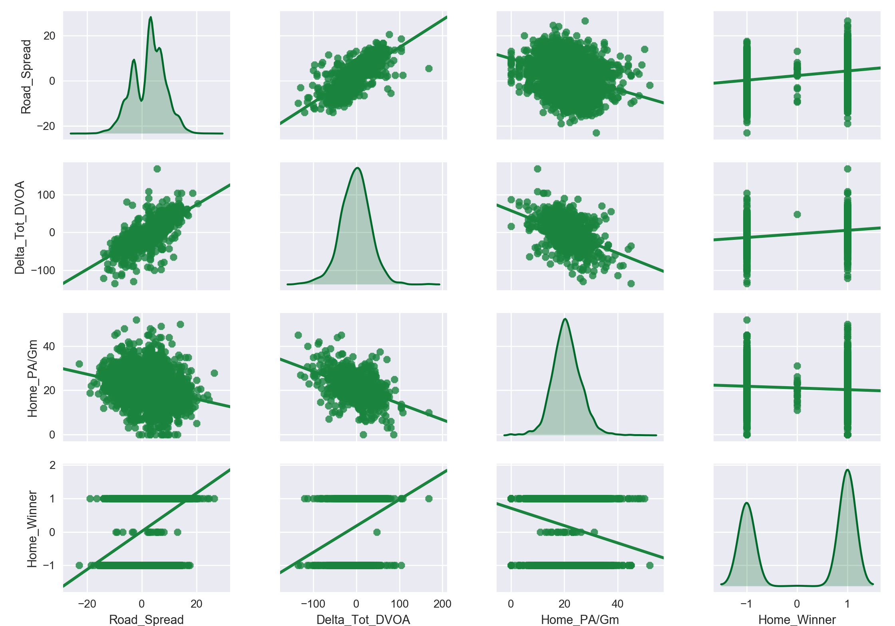

__Figure 25:__ The relationships between the three most important features in predicting the game winner, 1991-2016.  We see that the basic linear relationship between each is roughly comparable in magnitude, making the spread's reported importance worthy of more investigation.  The 'Home Winner' category includes ties (0) just to illustrate their scarcity via the distribution plot.

 

There doesn't appear to be a divide as sharp as the model's feature importance results suggest there is between the spread and the next two most important features.  After all, the difference in _Total DVOA_ and _Points Allowed per Game_ seem to be at least in the same ballpark as the spread for explaining the variance in the outcome of a game.  Recognizing that a simple linear regression is not asking the same question as "which feature has the biggest impact" is important.  Linear regression attempts to explain the variance in a target variable (game outcomes) as a result of changes in the independent variable (spread, DVOA, etc.). Feature importance is determined a [couple of ways](#feature-separation-and-importance), and generally measures the information gained about class separation, or purity, when a given feature is evaluated.  That said, I was curious as to what was causing the apparent discrepancy and decided to dig a little deeper.

##### Prediction Confidence
Back in the [Receiver Operating Characteristic](#receiver-operating-characteristic) section, we discussed how a classifier makes predictions about which class to assign a data point to with a certain level of probability.  We can access these probabilities for each prediction and investigate their results on a granular level.  One reason to do this is, much like using the ROC curve, we want to identify different threshold ranges in which the model does well or poorly.  Again, as the goal is to identify games which make wise bets, we are likely more interested in the _precision_ of our predictions (how many of the predictions we make are correct?) compared to the _recall_ (the ratio of games out of the dataset that are "positive" which we correctly identify).  (In short, think _quality_ over _quantity_).

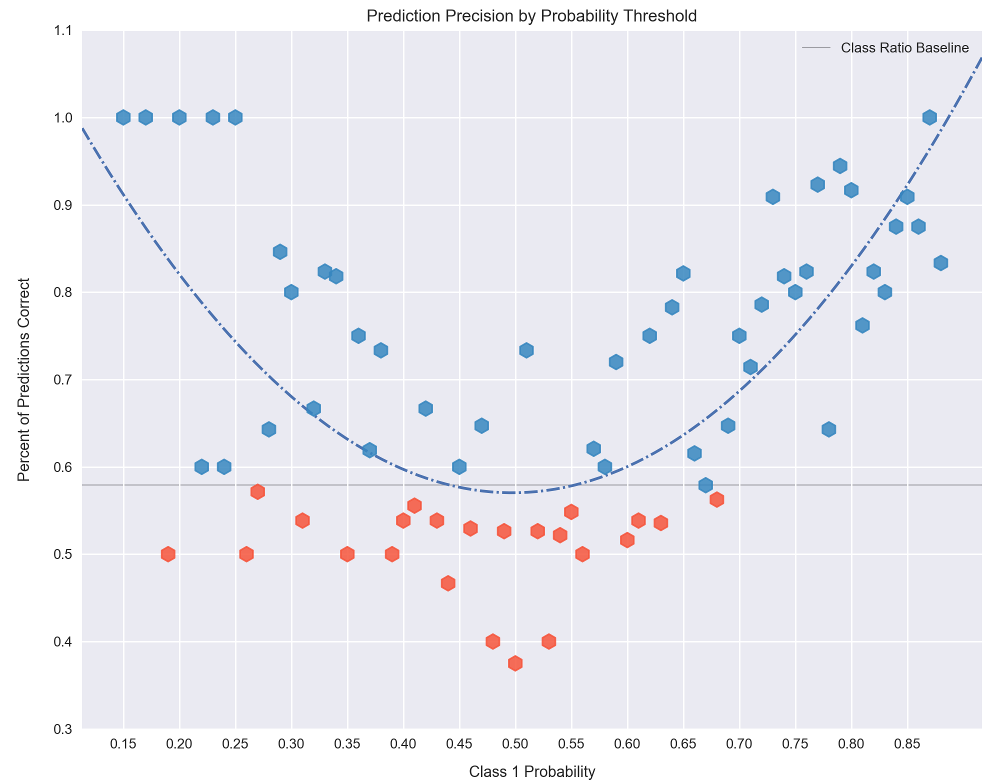

__Figure 26:__ The precision of our model for predicting the winner of a game by 1% probability threshold window.  The baseline for prediction of this target is 58%, since that is the ratio of home wins to home losses, represented by the thin horizontal black line.  The data points are colored corresponding to their value above or below this baseline, with red being worse than and blue being better than.

 

[Figure 26](#prediction-confidence) shows the mean precision for all predictions of whether a game will be won by the home team in an escalating 1% probability window, starting at 0% probability (which has no predictions) and ending at 100% probability (which also has no predictions).  At a 40%-41% threshold, we have a mean precision of 0.55 for all the predictions in this probability range, while at 41%-42% the precision is about 0.56.  Some ranges have no predictions made while others have a great number of them.  This is discussed further below.

Our model has the expected parabolic horseshoe curve we expect for precision.  At either extreme of the plot we are much more confident about our prediction.  Far to the left our probability of a game being classified as a home win (the "positive" class) is very low, meaning the probability of it being a home loss is very high.  The opposite is true on the far right of the graph.  As we progress toward the middle, where confidence in prediction waivers -- probability of 0.5 represents a 50/50 toss-up -- we see the precision dip.  The model just isn't sure about how to predict these games and gives a low confidence in its prediction correspondingly.  

The class ratio for predicting a game's winner is, as mentioned previously, 58% home winner and 42% road winner.  This means the _minimum_ level of accuracy we would ever accept is 58%, because all we have to do is label _every_ game a "home win" and we will be right 58% of the time.  Thus, our baseline is not the traditional 50% but rather 58%.  With this in mind, I colored each data point relative to this baseline.  Red is below, blue is above.  This helps to demonstrate the strong and weak points of the model over the entire probability range.  Again, the densest cluster of red points comes in the middle of the plot, where the predictions are least confident.  This makes sense.  Interestingly, once the model determines a game is going to be won by the home team with at least 70% probability (x-axis), it averages an above-baseline precision for every probability interval thereafter. It bears repeating that unless the precision is 1.0, there are some games in the given probability interval that it predicted incorrectly.

###### Cumulative Precision
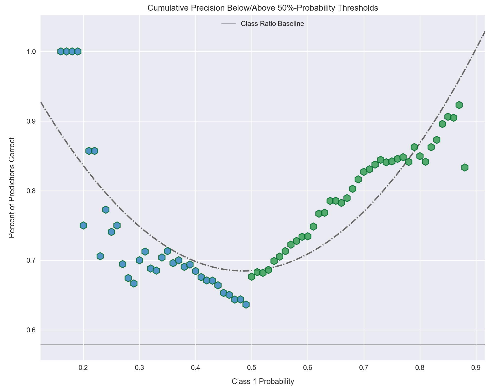

__Figure 27:__ Cumulative precision bifurcated at 0.50 probability threshold and colored by class of prediction, with blue being "home loss" and green being "home win".  The aim of this plot is to serve as a "betting cutoff" locator by allowing the user to see that all games with a 0.70 probability or higher average around an 83% success rate or better.  Hence, choosing to bet in favor of the home team winning only on games at or above the 0.70 probability threshold would ideally lead to a greater than 83% win rate over time.

 

Piggybacking on [Figure 27](#prediction-confidence), I wanted to take a look at while I'll term the "cumulative precision" for each side of the classification split.  Starting at 0.5 probability, in the center of the plot, proceed either left or right.  On either side are mean precision values for all the predictions of the respective class at that threshold and beyond.  

Since this is a bit of an uncommon plot, let me explain with more detail.  The blue data points represent predictions for class 0, "home loss", and green are class 1, "home win."  Starting at 0.51 and going to the right, each data point shows the mean precision for all predictions made for class "home win" at this threshold and above (the cumulative games at or beyond the threshold).  As we go further right, the confidence threshold for predicting a "home win" gets higher and our mean precision increases as a result.  However, the number of games per threshold range goes _down_ the further from the center we go.  That is, more games are near a 50/50 probability than are a 90% probability of being predicted correctly.  This makes sense, and we see it in [Figure 28](#games-per-season-by-confidence-level) below.  

The same description is true of the blue data points, which are below the .05 probability threshold and denote games that are predicted to be a "home loss."  In general, we see the model is less accurate in its predictions for games that are meant to be home losses than for games meant to be home wins.  My first hunch as to why this occurs is that it is simply a result of "home loss" being the minority class by a 42% to 58% ratio.  This means there are fewer games of this class to learn from in the training data and predicting these types of games is less precise.  

Also, with fewer games it means each incorrect prediction weighs more heavily on the aggregated result.  Conversely, it also means that the model has to make fewer correct predictions to have a perfect score, which is what we observe in the final four data points at the top left.  The two left-most points of the quartet are actually the same prediction: all predictions made at or below the threshold of 0.16.  There's only one prediction in this range, at 0.15, and it was correct.  So, as described above, if we start at 0.50 and go down in probability (left), when we arrive at 0.16 the only data point left is at 0.15.  Thus, all predictions at or below 0.16 were correct, as they were for 0.15 as well.  Because results from small sample sizes can be misleading, it is essential to understand how the sample sizes for each prediction range change.

The consequence of having fewer games at the tails of the prediction ranges means that the more confident we are about predicting a game, the fewer games we will have to make such a confident bet on.  In order to get a sensible handle on just how many or few games this pattern left us, I charted the distribution of games per season across all probability thresholds alongside the distribution of probabilities for predicting a "home win."  

###### Games Per Season by Confidence Level
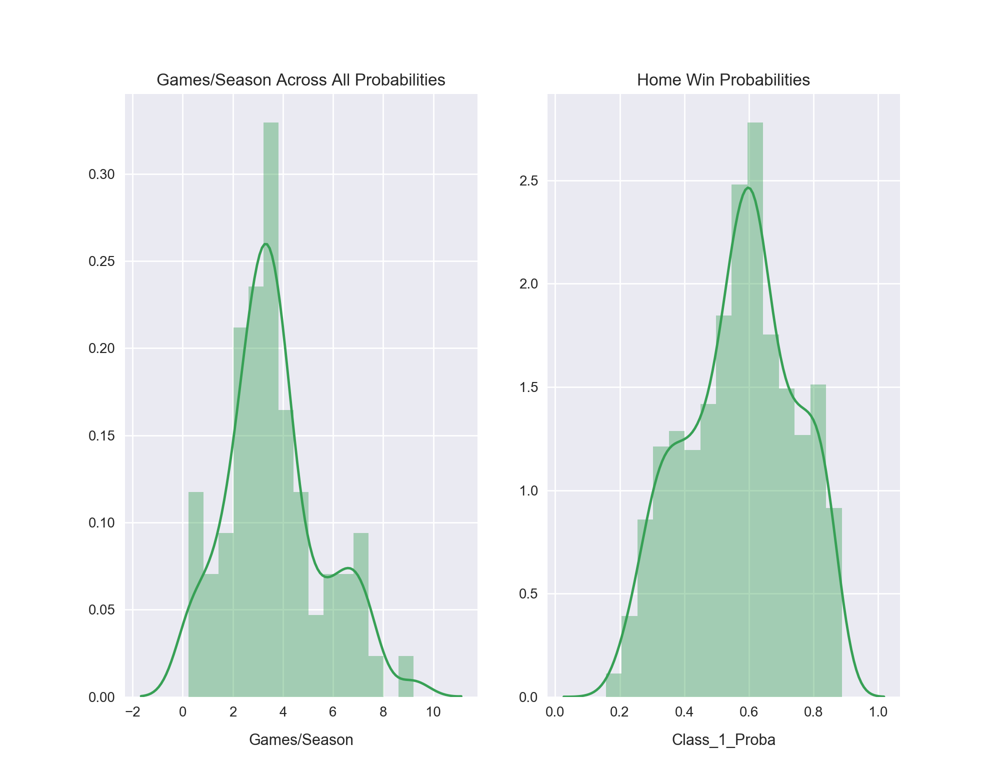

__Figure 28:__ The distributions for the number of games per season across all probability thresholds and for all the probabilities themselves.

 

The probability thresholds have a minimum of 0.15 and a maximum of 0.88.  No game lies outside of this nearly symmetric range.  However, the distribution of the probabilities is not quite as symmetric, with a noticeable density above the 0.50 probability divide.  This is a direct consequence of the 58%-to-42% class imbalance.  Since there are more games in the "home win" class, we expect and observe that our model makes more predictions for the "home win" result (above 0.50) than for the "home loss" result (below 0.50).  Looking at the peak of the kernel density estimate outline, we see it falls right at 0.60, which is close to 58%.  In fact, the true mean of all "home win" probabilities is .573 -- very, very close to 0.58!  (The reason the KDE peak is not 0.573 is simply a relic of the binning for the histogram).  

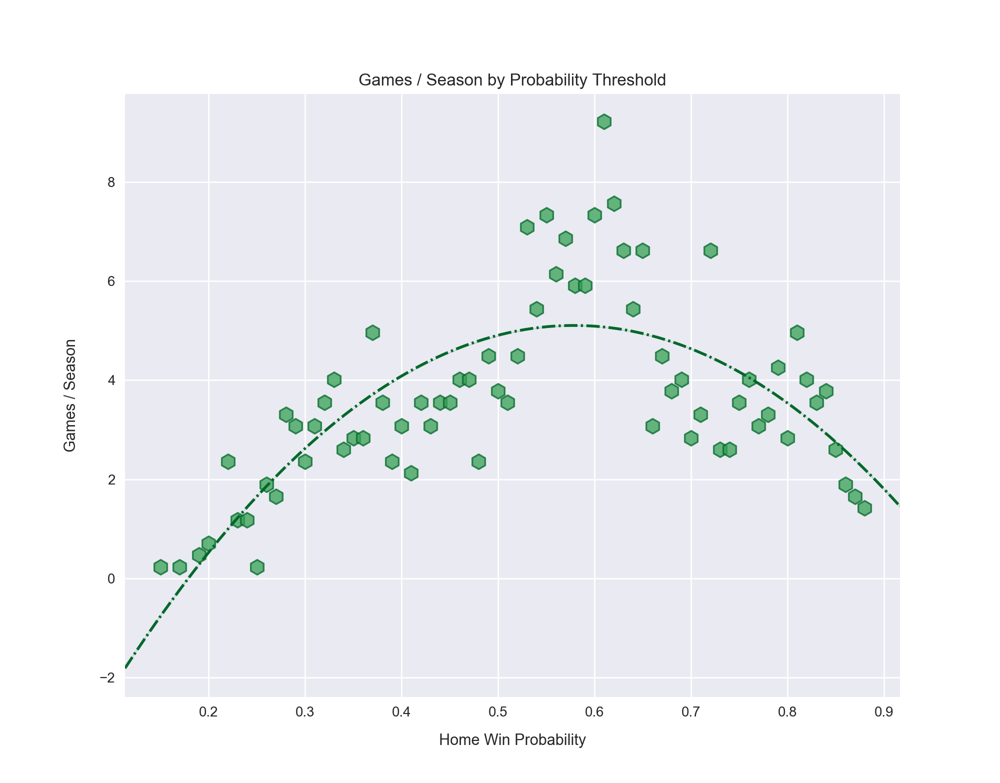
  
Since the number of games decreases as prediction confidence increases (in either direction), we want to make our bets count.  The smart approach would seem to be avoiding all games within the 0.40 to 0.60 range as a general rule, and perhaps even higher.  It's hard to sell oneself on a bet the model only has 62% confidence in, after all.  But making bets based on an arbitrary level of confidence is unwise and is easily bested by using the data in [Figure 26](#prediction-confidence) as a guide.

  

<b>Figure 29:</b> The number of games for each probability threshold window.  We see here the  
inverse of the prediction precision results from <i>Figure 711</i>, where the clear majority of  games occurs in the middle of the probability range and tails off sharply at either end.

 

###### Number of Games Played Impact on Confidence Level
As more games are played during a season the sample size for the underlying statistics describing each team grows.  With a larger sample size, might we not see an increase in the probability of a game's prediction, as the model has data that is more representative of the "true" quality of a team and can be more certain about its probability of winning or losing?  If a team is averaging 31 1st downs and 32.0 points per game after one game... then they had a great first game.  Congrats.  But if a team is averaging those same levels of performance after thirteen games, then we can feel more strongly about that team actually being excellent.  To take a quick gander into this, I binned the teams in the database by number of games played and charted the change in prediction confidence.

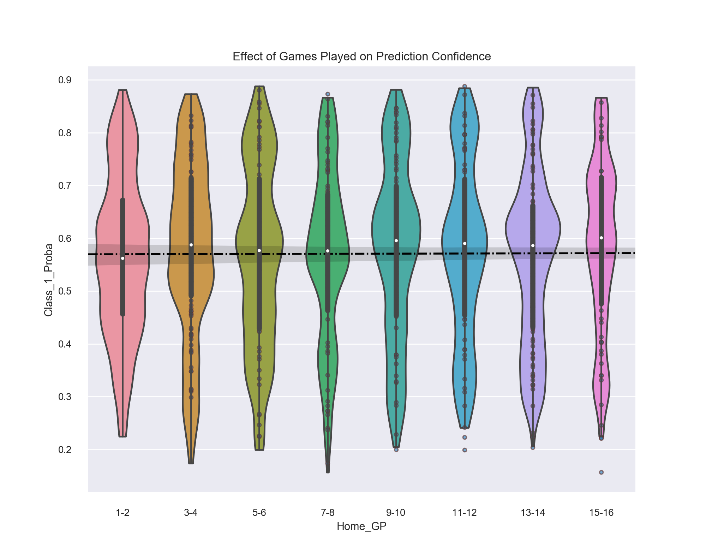

__Figure 30:__ The change in prediction confidence as number of games played goes up.  Games are binned into two games played per group. 

 

For those who aren't familiar with a violin plot, here are the key aspects:
1. The white dot is the mean for the given group.
2. The thick black vertical bar that is above and below the white mean dot is the inner-quartile range (25th-percentile on bottom, 75th-percentile on top)
3. The 'violins' extend upward and downward to cover all the data points in the group, with the tips of the 'violins' ending at the most extreme outliers in the group.  
    (_Note:_ In some groups, like 11-12 and 15-16, we some some data points outside violin plot, on their own.  This is because I used an option to have the violins do a 'hard cut' at the end, in order to prevent misleading the reader with pretty-but-inaccurate flowing tips)
4. The thickness of the violins is representative of the distribution of the data (pretend the plot was rotated 90°; the curve of the violin is just a distribution plot).  A thick area means more concentration of data points.
    (_Note:_ There are various options regarding how to plot distribution.  For clarity, these plots use density across groups, not within each group).

Well, there is no _major_ trend after all.  On _average_ prediction confidence bounces around the 56% to 58% range regardless of games played.  The mean of all prediction probabilities is 57.2%.  However, closer inspection reveals a pattern that divides the season in half.  Of the first four groupings of games played, one is below mean (1-2), and two others are just a hair above the mean (5-6, 7-8).  All three of these groups are within the 95% confidence interval for the mean (the light gray border around the dashed regression line).

In the second half of the season, all four are above the mean and three of the four (9-10, 11-12, 15-16) are significantly so.  All four groups's means are also above the regression line's 95% confidence interval.  This suggests that, yes, the more games played by a team the more confident the model is about its prediction.  Finding this interesting, I did the same plot for teams' _Total DVOA_, the third most important feature for this model in predicting winners.

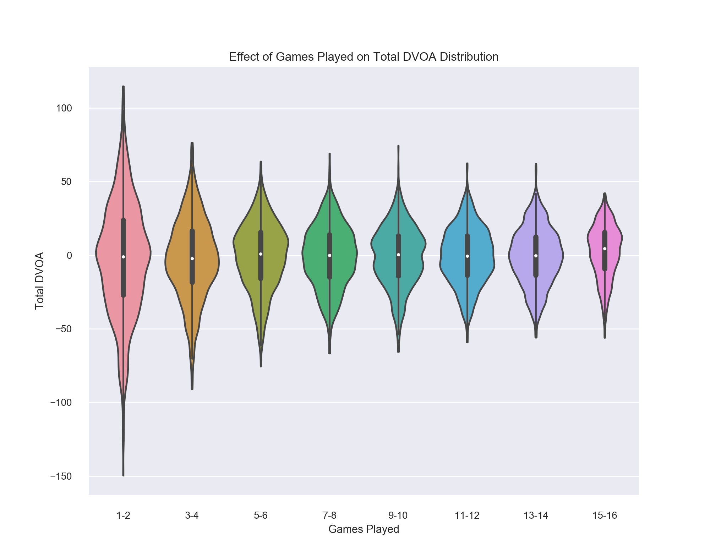

__Figure 31:__ The change in total DVOA by games played. 

 

The trend is more pronounced here.  Looking at the raw "under the hood" stats like DVOA shows the impact of sample size on the metric itself, which subsequently impacts the model's predictions.  With only one or two games played, the variance in the DVOA metric is quite large, over 50% in some cases, compared to the later weeks of the season.  As we increase the number of games played we see a condensing of the data, more bunched around the mean, giving shorter and thicker violins.  This reduction in variance due to increased sample size is what we expect, but it is neat to see it backed up by the data for real NFL teams.

##### Can We Make Money
Looking back at [Figure 27](#cumulative-precision), the cumulative precision shows us that once we get to, say, 0.70 probability, the precision for all predictions at or above 0.70 is 83% or higher.  That's encouraging, but we must remember this is the mean precision for all bets above (or below) a set threshold.  We'd expect the accuracy of prediction to be higher for bets the model was more confident about.  Regardless, if we believe we can be correct 83% of the time on all bets above 0.70 confidence,  shouldn't we just bet for the home team to win on every game that has a 70% or greater probability and ride off into the Nevada sunset?  It seems like a slam dunk -- choose the high-confidence bets and be guaranteed of success, right?  Well, it's not quite that simple for two primary reasons, one of which we have already touched upon and the other a secret [lurking in the darkness](https://www.youtube.com/watch?v=i_6w1EUGRoU).  

First, the number of games with a probability of the home team winning at or over 70% is around 19 per season, which is a smidge over one per week.  This isn't too bad, actually, but does make one susceptible to a few bad weeks in a row.  Depending on a bettor's financial reserves, he or she may not be able to afford to play (for any appreciable sum) after three or four consecutive losses.  

Second, and the biggest heartbreaker of this project (more so than the model's yielding "wise bets" by predicting against the spread that performed no better than chance, which is detailed below in the [Wise Bets Results](#wise-bets-results) section), is the model's adherence to the [power of the spread](#the-power-of-the-spread).  Let's have a look at how the confidence level of each prediction for who will win a game correlates with the spread and another top-3 feature, the difference in average completions per game between the two teams.

###### Predictions Mirror the Spread
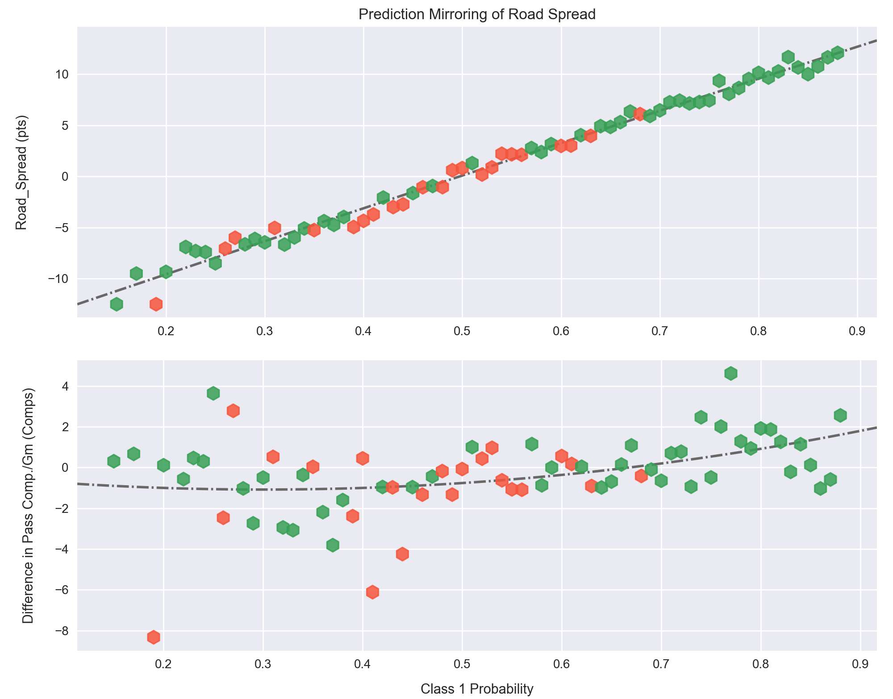

__Figure 32:__ Correlations between the confidence level of a prediction and two of the three most important features in deciding who will win a game.  The reliance of the model on the spread for making predictions is revealed here.  The red points denote the probability window (1%) in which the mean precision was below the prediction baseline of 58%, while the green represent those above 58%, just as in __Figure 26__

 

__Figure 32__ shows us what's really going on "under the hood" when our model is assigning a probability to its predictions.  Back in [Figure 721](#cumulative-precision), we saw the model become more successful on predictions made with higher confidence, as expected.  Ideally we could use this data to find a cutoff point for our own bets, selecting only games that carried a certain level of confidence in order to secure a highly favorable chance at winning each bet.  This approach is still valid, but the picture painted by __Figure 32__ carries a deflating realization: the confidence level of predictions is a near-perfect mirror of the spread for the game.  

Now we see where the spread assumes its dominant position among the most important features.  Compare the correlation of the prediction probability with the spread, the most important feature according to the model, to that of the third most important feature, the difference in average pass completions per game between the two teams playing.  While the completions delta statistic follows a general trend of increasing with probability, the spread is tightly hewn along the regression line (the simple OLS R2 is .838 for the confidence level and the spread).  Also, note that both regressions were plotted with a 2nd-order polynomial, but the spread is so dead-on that its line of best fit is still linear.

Why is this such a big deal, one may ask?  While it's clear the spread helps our model be much more accurate in its predictions, our model's demonstrated reliance upon it undermines the whole initial motivation for this project: to identify games which are significantly inaccurately valued by Vegas in order to profit from our exploitation of an inefficiency in the betting market.  That hope is eviscerated with this result.  All the games our model is confident about are overwhelmingly, but not uniformly, the same ones Vegas is confident about.  There is no great "hidden" value in these games.  

This leaves the standard choice of betting on a team with low confidence (the underdog), with low financial risk and high reward, or betting on a team with high confidence (the favorite) and paying a (potentially hefty) premium, creating a larger financial risk and lower payout.  Needless to say, while this is not a shocking conclusion, the realization that I wouldn't be able to become a multi-bajillionaire overnight by outsmarting Vegas left me personally rather [disappointed](https://www.youtube.com/watch?v=_O1hM-k3aUY)!  

#### Betting Approach - Game Winner
There are two ways we can make bets, now.  The first is constructed without having further access to the model and the second will be to use the model itself.  The driving point of laying out these two methods is to show that, despite there not being any _great_ hidden inefficiency in the betting market, that the model still outperforms traditional betting.  The fundamental purpose of using the model is to make bets based on its predicted _probability_ of a team winning, which though does largely align with the spread, it does not do so with a 100% correlation.  Thus, there appear to be _small_ inefficiencies the model is picking up on and these, we hope, will allow us to beat the averages of betting only with the spread.  

##### Betting by the Spread
If we didn't have access to this model going forward and only had the graphs above, we might consider looking at the rough equivalents for the spread of the probability thresholds that seemed to have success.  The model starts to perform reliably well -- around 71% or better precision -- on bets it gives a 0.70 or better confidence for the home team to win.  This equates to the home team being favored by around 6.2 points.  So, we would restrict our bets to home teams that have are favored by 6.0+ points.

But betting on a favorite means paying a premium.  We have to wager more money than we will win.  Because of this, the most confident bets also carry the highest financial risk for the favorite-backer.  So, we would want to avoid paying _extreme_ premiums if the increase in prediction confidence is only marginal (that is, we want a steeper slope of accuracy to spread).  Accepting that the cumulative precision is only a loose and optimistic-by-nature guide, looking at [Figure 27](#cumulative-precision) we see a mini-peak at 0.74 probability.  After this, there is a diminished return on precision for increase in probability, excluding the high-variance, small sample size results at the extreme.  A 0.74 probability equates roughly to a home team being favored by +7.5 points. So, we could forego bets on games where the home team is favored by more than 7.5 points.  

These are loose guides to help formulate our approach.  This strategy would leave us with bets on the home team when they are favored by 6.0, 6.5, 7.0, or 7.5 points.  There would be two questions left to answer: how much money on average do we expect to pay as a premium for each line, and how many games are there within that range each year?

###### Win Percent by Spread
To understand [how much we will have to pay](#interpreting-odds-and-the-payout) as a premium, we have to look at the median money line for all games in the database which have the spreads we are interested in.

Home Favorite | Road Money Line | Home Money Line | Home Team Win % | Games / Season | Frequency
--------------|-----------------|-----------------|-----------------|----------------|----------
6.0           | 220.0           | -260.0          | 0.693           | 8.9            | ~ every 2 weeks
6.5           | 237.5           | -280.0          | 0.665           | 8.3            | ~ every 2 weeks
7.0           | 255.0           | -310.0          | 0.718           | 12.2           | ~ 2 every 3 weeks
7.5           | 290.0           | -350.0          | 0.790           | 5.6            | ~ every 3 weeks

__Table 10:__ The relevant spreads for our betting approach, culled from __Tables A1__ and __A2__ in the appendix, 1978-2016.

 

I'll touch on the historical winning percentages below, but will first discuss the wagering process.  We see that the typical amount we have to wager as a premium to bet on a home favorite with our spreads of interest ranges from 2.6x to 3.5x what we want to win.  While the concept of financial risk is relative for every individual, it holds to reason that wagering three-and-a-half times the amount of money you stand to win counts as a legitimate "risk."  If we had hoped to win $1,000 on a single bet, we'd have to wager $2,600 to $3,5000.  With such financial liability it makes sense to distribute our "risk" amongst many smaller bets, hoping the model's precision is accurate, allowing us to win many smaller bets and overcome a few small losses.  

The feasibility of such an approach depends on how many candidate games there are.  If there are enough to spread our informed bets around, then we can pursue this method.  A quick glance at __Table 10__ shows us that there does indeed appear to be enough of a sample for us to try to minimize our overall risk.  The two lines at -6.0 and -6.5 have a roughly equal rate of occurrence, about once every two weeks of a regular season.  Combined, that gives about once a week throughout the season.  For the two lines at -7.0 and -7.5, we have a bigger difference between the two but a combined count nearly identical to the 6s, giving us around one bet per week.  In sum, if we consider all four spreads there are 1,371 games in the database, meaning we should expect to see around two games per week that we can wager on, totaling around 34 possible bets, or 12% of all NFL games in a season.  Of these 1,371 games, 970 were predicted correctly by Vegas straight-up, which gives a 70.7% win rate for these four values of the spread.

##### Betting by Model Probabilities
So, why even use the model?  Why not just bet all games with the home team favored by 6.0 - 7.5 points?  Well, while it is clear the model follows the spread, not all games in this range are equally confident.  As mentioned above, there is no great hidden value to be found betting against Vegas, but the model does still outperform the spread alone.  Here is a table showing the actual values for the spread range of interest.  

Home Favorite | Historical Home Win % | Model Home Win % | Model ∆
--------------|-----------------------|------------------|--------
6.0           | 0.693                 | 0.719            | +0.026
6.5           | 0.665                 | 0.722            | +0.057
7.0           | 0.718                 | 0.719            | +0.001
7.5           | 0.790                 | 0.919            | +0.129

__Table 11:__ Table showing the difference between the marginal differences between model's predictions and the historical outcomes.  Taken from __Tables A1__ and __A2__ in the appendix.

 

It appears the model is effectively using the other data in the database to make more precise predictions than the spread alone, but at an relatively inconsequential level that can't be said to be beyond simple sample margin of error.  Still, grouping bets by the spread is the _wrong_ approach -- the model might have higher or lower probabilities for some of the bets in the given spread range.  We want to see how the model performs when grouped by _probability_.  

One important point to make about these results is that the model's predictions were made on 1,100 games after being trained on 4,488 games, while the historical averages are real data from 9,046 games.  Depending on the random draw of the samples the model is trained on and then tested on, some degree of fluctuation in these percentages is guaranteed.  Such variance is just a fact of smaller sample sizes.  Thus, taking the outcomes above as written in stone is not the correct way to view this problem.  Instead, it stands to show that the model is predicting well enough to compare with historical data and is a valid tool to use in making bets.  

###### Win Percent by Model Probability
Home Win Probability | Home Win % | Mean Home Favorite | Number of Games
---------------------|------------|--------------------|----------------
| 0.68               | 0.56       | 6.09               | 16
| 0.69               | 0.65       | 5.91               | 17
| 0.70               | 0.75       | 6.46               | 12
| 0.71               | 0.71       | 7.25               | 14
| 0.72               | 0.79       | 7.41               | 28
| 0.73               | 0.91       | 7.14               | 11
| 0.74               | 0.82       | 7.27               | 11
| 0.75               | 0.80       | 7.43               | 15

 __Table 12:__ Home team winning percentage as grouped by the model's prediction probabilities for the home team to win.  

 

In __Table 12__ we see the home team winning percentages for each probability in the range selected above in [Betting by the Spread](#betting-by-the-spread) (that is, home favorites of 6.0 - 7.5 points).  First, the mean home spread jumps around -- it is not exactly linear with the probabilities.  This verifies what we discussed above in the [intro](betting-by-model-probabilities) to this section, that the model is finding some small but valuable information in the database which makes it more precise than the spread alone.  Second, note the high variance in the winning percentage for each given probability.  This is a result of the small sample sizes -- for example, out of the 1,100 games in the test dataset only 16 were given a probability of 0.68 <= x < 0.69 for the home team to win. And so on for the rest of the probabilities.   

But we wouldn't want to bet with only a single-point probability.  Instead we'd want to use a range, such as 0.68 - 0.75, which would give us 124 games worth of bets.  Of these 124 games, 92 were predicted correctly, giving us a 74.3% win rate from the model.  This compares favorably to the method of using the spread.

###### Model vs Spread Bets
Method | Min Home Favorite | Max Home Favorite | Total Games | Bet Win %
-------|-------------------|-------------------|-------------|----------
Spread | 6.0               | 7.5               | 1,371       | 70.7
Model  | 5.9 (mean)        | 7.4 (mean)        | 124         | 74.3

 __Table 13:__ The model compares favorably to the spread, but suffers from a smaller sample size.

 

Upon first glance this is a strongly encouraging result.  But, and there's a big "but" ([Sir-Mix-A-Lot](https://www.youtube.com/watch?v=reTx5sqvVJ4) jokes preemptively acknowledged),the sample size is an order is an order of magnitude smaller than the spread's.  This is not an apples-to-apples comparison.  So, understanding the potential vagaries of a small sample, I tracked how using the spread as our betting rubric would have performed for those same 124 games the model got to use.  

###### Model vs Spread, Same Bets
Method | Min Home Favorite | Max Home Favorite | Total Games | Bet Win %
-------|-------------------|-------------------|-------------|----------
Spread | 2.5               | 13.0              | 124         | 74.2
Model  | 5.9 (mean)        | 7.4 (mean)        | 124         | 74.3

 __Table 14:__ Using the same games, the spread is now equal to the model.

 

Wow.  Big difference that made!  For these 124 games, the spread predicted just as well as the model.  The interesting finding is that the spread for these specific 124 games covers a broad range, well outside the 6.0 - 7.5 point window we would have been betting on via the spread.  This means that some of these 124 games were not in the 1,371 used in the spread-range limited selection above, obviously.  It also shows us that the model considered games that had a home team favored by as low as 2.5 point and has high as 13.0 points to be in the same probability window (0.68 - 0.75) for games it believed were roughly equivalent to the traditional 6.0 - 7.5 home favorite point range.

Clearly, limiting our confidence threshold range to probabilities that align with Vegas spreads places arbitrary restrictions on our model -- we want to know what the best possible range of probability thresholds for our model is.  Maybe it's 0.56 to 0.61?  Or 0.64 to 0.72?  To answer this question I conducted what amounts to a grid search over all threshold windows for games the model classified as greater than 0.50 probability for a home team to win.  I should note I also searched for the best outcome of games predicted as a home loss, but the results were significantly worse.  The accuracy of the model is not equal on both sides of the spread.  It is more reliable, due to a larger class sample size, in predicting when a home team will when than when they will lose.  

 
 

### Wise Bets Results
Here we put our money where our mouth is.  In an effort to keep things manageable, we will agree to wager the exact money line for each game that falls into our confidence window in which the home team is predicted to win.  This means that for every bet we win, we net $100.  For every bet we lose, we lose the amount of the money line, typically around $200 - $500.  A running tally of our winnings is kept, and the threshold range which provides us the highest winnings will be identified as the best choice for using the model.  For reference, the number of bets made and the percent that win will also be marked.  This will help provide context and avoid choosing a threshold range that misleadingly correctly predicts, say, nine out of only ten bets, for a sterling 90% win rate....

__Figure 33:__ The running balance after each bet made by using the optimum thresholds in the model. The test data we use is 1,100 games, or about 4.23 NFL seasons' worth of games.

 

Not too bad!  Using the optimal threshold range of 0.72 to 0.81, our model earns a grand total of $4,430 in just over four seasons worth of games, leaving us winnings of $1,047 per season on a total of 139 bets placed.  A couple things stand out.  

First, our model takes us $310 into the red after some early losses.  Depending on the bettor's allotted cash this may mean they can not afford to continue betting in order to get out of this early hole.   One possible solution is to prioritize a threshold range which has the least negative value for winnings in order to avoid going negative beyond a given dollar limit.  As is, the goal is to maximize profit, which means we are accepting the fact we might have some bumpy stretches on the way to our final earnings.  Again, since we are betting on the favorite we are only going to win $100 per successful bet, but lose some multiple (the amount wagered) of that for each loss.  Profit by 1,000 cuts...

Second, the amount wagered is shown as the dotted black line.  In it we see some sharp spikes, reaching well over $1,000.  While our model says these games were in our specified threshold range, Vegas had them listed well above our maximum threshold leading to their requiring a very, very high wager by us.  (In other words, our model said Vegas was overrating the favorite).  In reality, no matter how confident we or the model are about a game, I don't envision anyone wanting to risk $1,850 -- the maximum bet made -- to win only $100.  So, I added an option to limit the maximum amount we'd bet, regardless of if the game was in our specified confidence range, and plotted the results with a maximum bet cutoff of $1,000.

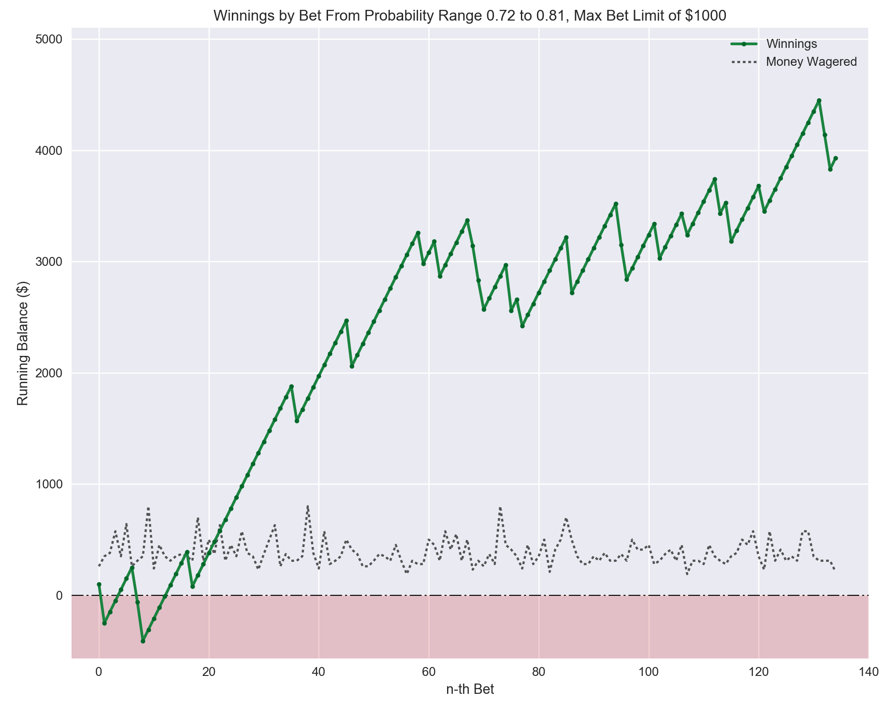

__Figure 34:__ The same running balance plot as in __Figure 33__ except with a maximum bet cutoff at $1,000. 

 

The end result is interesting from a risk/reward standpoint.  There were four bets over $1,000 in the initial run.  By limiting our maximum bet to $1,000, those bets were not placed.  All four bets did win, bring +$400 to our total in the original scenario.  That's $400 we now lose out on  However, the amounts we wagered on those four bets were $1637, $1400, $1850, and $1400, respectively.  That's a whopping $6,287 we had to risk in order to win $400!  So, the risk vs. reward ratio should benefit from capping how much we are willing to wager.

###### Limiting Maximum Bets
Max Bet Limit | Bets Won | Bets Made | Win % | Total Wagered | Net Winnings   | Net Per Bet | Risk/Reward Ratio
--------------|----------|-----------|-------|---------------|----------------|-------------|------------------
None          | 116      | 139       | 83.45%| $58,042       | $4,330         | $31.15      | $13.40 in risk
$1,000        | 112      | 135       | 82.96%| $51,755       | $3,930         | $29.11      |__$13.16 in risk__
$750          | 109      | 132       | 82.57%| $49,355       | $3,630         | $27.50      | $13.59 in risk
$650          | 107      | 130       | 82.31%| $47,955       | $3,430         | $26.38      | $13.98 in risk
$600          | 104      | 127       | 81.89%| $46,055       | $3,130         | $24.65      | $14.71 in risk
$550          | 96       | 119       | 80.67%| $41,455       | $2,330         | $19.58      | $17.79 in risk
$500          | 95       | 118       | 80.50%| $40,905       | $2,230         | $18.89      | $18.34 in risk

 __Table 15:__ Results from using different limits for a maximum bet.  The winningest model doesn't necessarily minimize risk. No bets between $750 and $1,000 existed, so those cutoffs were omitted.

 

With different betting limits we observe a few noteworthy results.  The win percentage is just the number of games in the threshold that the home team won, since they're the team we are betting to win in each.  The insight the model gives is that some of these games are slightly inaccurately valued by Vegas.  This is borne out in the Risk/Reward Ratio, as we can minimize our risk by excluding bets over $1,000.  Setting our bet limit to a lower cutoff than $1,000 is actually counter productive in terms of risk to reward.  As we continue to lower our limit we start missing out on more bets at an unfavorable ratio.  For the probability ranges of 0.72 to 0.81 for a home team to win, the ideal max bet we should make to minimize our risk-to-reward ratio is $1,000.  There is a small caveat: no bets between $750 and $1,000 existed in this test, so it is possible that an even lower risk-to-reward ratio could be found at a cutoff in this range.

The result above is the rosiest possible outcome.  This bears repeating -- while our predictions were made fairly, our review of them was not.  We examined every possible outcome from every betting threshold and cherry picked the best one.  While this is a smart approach to using the model for future bets because we do want to know which confidence thresholds are likely to give us the best results going forward, it is no guarantee that these results actually _would_ be repeated by betting on future games.  Just think, if the games we made the predictions above on had not yet happened, how would we know to use the thresholds of 0.72 to 0.81?  Yes, we would perform the same experiment we just did on previous years' data, but it very well could have shown us the best threshold for that dataset was, say, 0.69 to 0.77.  Using that same range on the games in the test we ran above would produce some sub-optimal result!  It _is_ possible that the probability window of 0.72 to 0.81 we found above will be successful on future bets.  But we should be aware of the uncertainty inherent in our task. This, of course, the nature of prediction, and especially so of predicting sports outcomes.  

As a closing argument to this project, I wanted to hammer home this point by finding the _worst_ confidence interval for our model and plotting it.  Seeing is believing, so get ready to believe you can go broke  while betting on sports (especially if you ignore my model. Joking....)

__Figure 35:__ The results of using the worst probability interval on this model.  So, don't do this.

 
 
 

## Future Considerations
There can be many improvements made.  Most deal with added data.
1. Account for injuries.  Very granular data work, but could restrict it to key positions like QB, WR, S, DE, etc.  This would allow a _much_ more accurate prediction on the few games where a team is playing without their starting QB, for example.  I'm not sure the model would pick up on this or not, but we could simply have a dummy column called "Starting_QB", 1 for yes and 0 for any backup.  It might be drowned out because its a fairly uncommon occurrence, statistically speaking.  But it might not.  Also, would want to have some team-level injury information.  How many players are injured (using the NFL's injury designations) for a given game?  This will absolutely increase model accuracy.

2. Compute ANY/A per QB, not per team.  Thus, if a team loses their starting QB, we can use the backup's career or projected ANY/A in his place.  

3. Utilize the many remaining statistical tables from PFR I scraped.  These include:
    + Individual passing and rushing stats.
    + Individual defensive stats.
    + Kicking stats
    + Play-by-play charts, with types of scoring plays and side of field info.

4. Miles traveled and direction traveled.  Traveling has an observed effect on player performance.  This would be very doable since we already have the location of each game by virtue of knowing which team is the home team and which is the visiting team, we could simply fill in the distance for each game.  Come to think of it, this is easy enough I should have done it initially.  Dang.

5. Coaching.  I'm not sure how to implement this yet, but somehow tracking and accounting for coaching would be great.  My first hunch is that there are only a few coaches that _actually_ matter for their teams (Belichick, Carroll, Reid, Harbaugh...) and the rest are just middling presences on the sideline.

6. Date.  I have the date information, but I didn't break it down into features the model could use.  My thinking is that I wonder if certain types of teams, which could be categorized by their per game statistics such as rushing attempts per game or passing yards per game, etc., start to have more or less success as the season changes from summer to winter.  

7. Break down scoring by offense, defense, and special teams just to produce easily quantifiable stats that the model might be able to find a through line with.

8. Big one: contract years! Players playing in a contract year are surely going to play better than non-contract years (their livelihood depends on it). Would need to tally number of starters in a contract year.  Could then also break down by position.

9. Team age.  Average age of each position group, such as LB, QB, WR, etc., and then also total team age (could use Football Outsider's snap-weighted age metric)  

10. Game type clusters and how they break down into the various predictions.

11. TV Announcers.  We all know certain announcers are curses for certain teams.  Just kidding. ;)

 
 

## Glossary
+ __DVOA:__ Defense-adjusted Value Over Average
    + Football Outsiders' proprietary metric developed by Aaron Schatz.  Breaks down into overall, offense, defense, and special teams.  Is based on success rate of a given play being defined by down-and-distance as well as game scenario and situation.  The metric is normalized and reported in percentages above the mean of 0.0.

+ __EPA:__ Expected Points Added
    + Similar to DVOA, though uses fewer inputs. Based on expected outcome of a play for an average team having the ball on a given yard line with a given number of yards to go.  Originally devised by Bob Carroll and Pete Palmer in their seminal work, "The Hidden Game of Football."   A common range is +/- 15, negative being bad.  

+ __ANY/A:__ Adjusted-Net Yards per Attempt
    + A passing-only metric which takes all passing-related statistics as input and returns a single number, usually in the range of 4.0 (very bad) to 10.0 (very good).  This means that for each attempted pass (sacks included!) that a QB makes, he ended up with X net yards for his team.  I'm unsure who developed it but Chase Stuart is the person who updated it to reflect the modern increase in value of passing.

+ __Pythagenport Win %__
    + A twice-modified metric that stems from the "godfather" of modern sports analytics (also termed "Sabremetrics"), Bill James.  James created the one-stat-fits-all metric called the Pythagorean Win Expectancy for baseball in the 1970s.  It was a glorified ratio of a team's runs score to runs surrendered that described "true" team quality irrespective of their W-L record very well.  It's loose visual resemblance to the Greek mathematician's famous right triangle equation earned it its name.  

        Current Houston Rockets GM, Darryl Morrey, adapted it for football in the late 1990s, with a fixed exponent that caused it to under-or-overrate teams on the extremes.  Chase Davenport adjusted it to account for a team's "scoring environment", which gives it flexibility and slightly rewards teams that have equal ratio of statistical success with more total points, as more points means a larger sample size by which to increase certainty of the rating.

 
 

## Appendix
###### Table A1 - Money Line And Win % Values as Home Favorite, 1978-2016
Home Favorite | Road Money Line | Home Money Line | Home Team Win %
------------|-----------------|-----------------|----------------
1.0         | 100.0           | -115.0          | 0.528
1.5         | 105.0           | -125.0          | 0.496
2.0         | 115.0           | -135.0          | 0.569
2.5         | 120.0           | -140.0          | 0.531
3.0         | 140.0           | -160.0          | 0.587
3.5         | 160.0           | -190.0          | 0.607
4.0         | 175.0           | -210.0          | 0.609
4.5         | 180.0           | -220.0          | 0.647
5.0         | 190.0           | -230.0          | 0.706
5.5         | 200.0           | -240.0          | 0.666
6.0         | 220.0           | -260.0          | 0.693
6.5         | 237.5           | -280.0          | 0.665
7.0         | 255.0           | -310.0          | 0.718
7.5         | 290.0           | -350.0          | 0.790
8.0         | 300.0           | -370.0          | 0.747
8.5         | 310.0           | -380.0          | 0.810
9.0         | 335.0           | -410.0          | 0.781
9.5         | 357.5           | -452.5          | 0.812
10.0        | 400.0           | -500.0          | 0.807
10.5        | 430.0           | -575.0          | 0.772
11.0        | 425.0           | -550.0          | 0.829
11.5        | 445.0           | -575.0          | 0.872
12.0        | 490.0           | -630.0          | 0.857
12.5        | 477.5           | -640.0          | 0.829
13.0        | 500.0           | -700.0          | 0.864
13.5        | 600.0           | -800.0          | 0.802
14.0        | 675.0           | -950.0          | 0.830

 
 

###### Table A2 - Number of Games by Spread, 1978-2016
Home Favorite  | Number Games
--------|------------------------
3.0     | 814
3.5     | 476
7.0     | 476
6.0     | 349
6.5     | 326
4.0     | 320
2.5     | 320
2.0     | 244
4.5     | 221
7.5     | 220
5.5     | 210
1.0     | 210
10.0    | 208
5.0     | 191
9.0     | 188
8.0     | 170
1.5     | 155
9.5     | 144
8.5     | 116
10.5    | 110
11.0    |  94
13.5    |  91
13.0    |  81
14.0    |  65
12.0    |  56
11.5    |  47
12.5    |  41

 
 

###### Table A3 - Home Win % by All Spreads, 1978-2016
Home Spread	| Home Win % | Home Spread | Home Win %
------------|------------|-------------|-----------
23.0        | 0.000      | -0.0        | 0.558
19.0        | 1.000      | -1.0        | 0.528   
18.5        | 0.000      | -1.5        | 0.496   
17.5        | 0.000      | -2.0        | 0.569
16.5        | 1.000      | -2.5        | 0.531
16.0        | 0.000      | -3.0        | 0.587
15.5        | 0.000      | -3.5        | 0.607
15.0        | 0.000      | -4.0        | 0.609
14.5        | 0.000      | -4.5        | 0.647
14.0        | 0.250      | -5.0        | 0.706
13.5        | 0.000      | -5.5        | 0.666
13.0        | 0.307      | -6.0        | 0.693
12.5        | 0.200      | -6.5        | 0.665
12.0        | 0.125      | -7.0        | 0.718
11.5        | 0.500      | -7.5        | 0.790
11.0        | 0.173      | -8.0        | 0.747
10.5        | 0.192      | -8.5        | 0.810
10.0        | 0.297      | -9.0        | 0.781
 9.5        | 0.170      | -9.5        | 0.812
 9.0        | 0.313      | -10.0       | 0.807
 8.5        | 0.250      | -10.5       | 0.772
 8.0        | 0.276      | -11.0       | 0.829
 7.5        | 0.268      | -11.5       | 0.872
 7.0        | 0.255      | -12.0       | 0.857
 6.5        | 0.291      | -12.0       | 0.857
 6.0        | 0.340      | -12.5       | 0.829
 5.5        | 0.311      | -13.0       | 0.864
 5.0        | 0.375      | -13.5       | 0.802
 4.5        | 0.277      | -14.0       | 0.830
 4.0        | 0.357      | -14.5       | 0.864
 3.5        | 0.383      | -15.0       | 0.950
 3.0        | 0.431      | -15.5       | 1.000
 2.5        | 0.504      | -16.0       | 0.941
 2.0        | 0.461      | -16.5       | 1.000
 1.5        | 0.519      | -17.0       | 0.900
 1.0        | 0.479      | -17.5       | 0.800
|           |            | -18.0       | 1.000
|           |            | -18.5       | 1.000
|           |            | -19.0       | 1.000
|           |            | -19.5       | 1.000
|           |            | -20.0       | 1.000
|           |            | -20.5       | 1.000
|           |            | -21.5       | 1.000
|           |            | -22.5       | 1.000
|           |            | -24.0       | 1.000
|           |            | -24.5       | 1.000
|           |            | -26.5       | 1.000

 
 

###### Table A4 - Model Accuracy by Spread
Home Spread | Mean Home Win Proba | Prediction Win %
------------|----------------|-----------------
14.0        | 0.24           | 0.500
13.5        | 0.28           | 1.000
12.5        | 0.26           | 1.000
12.0        | 0.27           | 1.000
11.5        | 0.37           | 0.000
11.0        | 0.22           | 1.000
10.5        | 0.24           | 1.000
10.0        | 0.34           | 0.857
9.5         | 0.27           | 0.875
9.0         | 0.29           | 0.429
8.5         | 0.32           | 0.500
8.0         | 0.32           | 0.500
7.5         | 0.36           | 0.700
7.0         | 0.31           | 0.714
6.5         | 0.35           | 0.684
6.0         | 0.32           | 0.714
5.5         | 0.34           | 0.688
5.0         | 0.37           | 0.400
4.5         | 0.31           | 0.786
4.0         | 0.33           | 0.471
3.5         | 0.41           | 0.645
3.0         | 0.43           | 0.525
2.5         | 0.43           | 0.387
2.0         | 0.44           | 0.700
1.5         | 0.51           | 0.600
1.0         | 0.53           | 0.476
-0.0        | 0.55           | 0.545
-1.0        | 0.53           | 0.667
-1.5        | 0.55           | 0.586
-2.0        | 0.57           | 0.500
-2.5        | 0.56           | 0.500
-3.0        | 0.58           | 0.612
-3.5        | 0.60           | 0.629
-4.0        | 0.62           | 0.676
-4.5        | 0.61           | 0.657
-5.0        | 0.66           | 0.533
-5.5        | 0.68           | 0.611
-6.0        | 0.65           | 0.719
-6.5        | 0.68           | 0.722
-7.0        | 0.73           | 0.719
-7.5        | 0.78           | 0.919
-8.0        | 0.75           | 0.762
-8.5        | 0.76           | 0.692
-9.0        | 0.78           | 0.800
-9.5        | 0.79           | 0.950
-10.0       | 0.79           | 0.833
-10.5       | 0.80           | 0.714
-11.0       | 0.81           | 1.000
-11.5       | 0.76           | 1.000
-12.0       | 0.79           | 0.800
-12.5       | 0.82           | 1.000
-13.0       | 0.82           | 0.818
-13.5       | 0.82           | 0.875
-14.0       | 0.86           | 0.857
-14.5       | 0.85           | 0.800
-15.0       | 0.82           | 1.000
-15.5       | 0.86           | 1.000
-16.5       | 0.79           | 1.000
-17.0       | 0.79           | 1.000
-18.5       | 0.80           | 1.000
-20.5       | 0.84           | 1.000

 
 

###### Table A4 - Model Predictions for Home Winner by Probability
Prob. Home Team Win | Road Win % | Mean Home Spread | Prob. Home Team Win | Home Win % | Mean Home Spread
--------------------|------------|------------------|---------------------|------------|------------------
0.15                | 1.00       | 12.50            | 0.50                | 0.38       | -0.81           
0.17                | 1.00       | 9.50             | 0.51                | 0.73       | -1.30   
0.19                | 0.50       | 12.50            | 0.52                | 0.53       | -0.18         
0.20                | 1.00       | 9.33             | 0.53                | 0.40       | -0.88     
0.22                | 0.60       | 6.90             | 0.54                | 0.52       | -2.22
0.23                | 1.00       | 7.30             | 0.55                | 0.55       | -2.16          
0.24                | 0.60       | 7.40             | 0.56                | 0.50       | -2.12
0.25                | 1.00       | 8.50             | 0.57                | 0.62       | -2.78    
0.26                | 0.50       | 7.06             | 0.58                | 0.60       | -2.38      
0.27                | 0.57       | 6.00             | 0.59                | 0.72       | -3.16     
0.28                | 0.64       | 6.64             | 0.60                | 0.52       | -2.98      
0.29                | 0.85       | 6.12             | 0.61                | 0.54       | -3.01    
0.30                | 0.80       | 6.45             | 0.62                | 0.75       | -4.03
0.31                | 0.54       | 5.04             | 0.63                | 0.54       | -3.96  
0.32                | 0.67       | 6.67             | 0.64                | 0.78       | -4.91
0.33                | 0.82       | 5.97             | 0.65                | 0.82       | -4.84      
0.34                | 0.82       | 5.09             | 0.66                | 0.62       | -5.31     
0.35                | 0.50       | 5.25             | 0.67                | 0.58       | -6.34         
0.36                | 0.75       | 4.38             | 0.68                | 0.56       | -6.09  
0.37                | 0.62       | 4.74             | 0.69                | 0.65       | -5.91    
0.38                | 0.73       | 3.97             | 0.70                | 0.75       | -6.46     
0.39                | 0.50       | 4.95             | 0.71                | 0.71       | -7.25   
0.40                | 0.54       | 4.35             | 0.72                | 0.79       | -7.41     
0.41                | 0.56       | 3.72             | 0.73                | 0.91       | -7.14  
0.42                | 0.67       | 2.07             | 0.74                | 0.82       | -7.27     
0.43                | 0.54       | 3.00             | 0.75                | 0.80       | -7.43    
0.44                | 0.47       | 2.73             | 0.76                | 0.82       | -9.35       
0.45                | 0.60       | 1.63             | 0.77                | 0.92       | -8.08    
0.46                | 0.53       | 1.06             | 0.78                | 0.64       | -8.64       
0.47                | 0.65       | 0.94             | 0.79                | 0.94       | -9.53    
0.48                | 0.40       | 1.05             | 0.80                | 0.92       | -10.12      
0.49                | 0.53       | -0.61            | 0.81                | 0.76       | -9.67            
|                   |            |                  | 0.82                | 0.82       | -10.26            
|                   |            |                  | 0.83                | 0.80       | -11.67            
|                   |            |                  | 0.84                | 0.88       | -10.66            
|                   |            |                  | 0.85                | 0.91       | -10.00            
|                   |            |                  | 0.86                | 0.88       | -10.75            
|                   |            |                  | 0.87                | 1.00       | -11.64            
|                   |            |                  | 0.88                | 0.83       | -12.08            

###### Table A5 - Historical 'Cumulative' Home Win Percent (bifurcated), 1978-2016
(To be compared against model's "cumulative precision above threshold")
Home Spread | Home Win Percent | Home Spread | Home Win Percent
------------|------------------|-------------|-----------------
23.0        | 0.00             | -0.0        | 0.67
19.0        | 0.50             | -1.0        | 0.68
18.5        | 0.33             | -1.5        | 0.68
17.5        | 0.25             | -2.0        | 0.69
16.5        | 0.40             | -2.5        | 0.69
16.0        | 0.29             | -3.0        | 0.70
15.5        | 0.22             | -3.5        | 0.72
15.0        | 0.18             | -4.0        | 0.74
14.5        | 0.10             | -4.5        | 0.75
14.0        | 0.15             | -5.0        | 0.76
13.5        | 0.12             | -5.5        | 0.76
13.0        | 0.16             | -6.0        | 0.77
12.5        | 0.17             | -6.5        | 0.78
12.0        | 0.16             | -7.0        | 0.79
11.5        | 0.20             | -7.5        | 0.81
11.0        | 0.19             | -8.0        | 0.82
10.5        | 0.19             | -8.5        | 0.83
10.0        | 0.22             | -9.0        | 0.83
9.5         | 0.21             | -9.5        | 0.83
9.0         | 0.23             | -10.0       | 0.84
8.5         | 0.23             | -10.5       | 0.85
8.0         | 0.24             | -11.0       | 0.86
7.5         | 0.24             | -11.5       | 0.86
7.0         | 0.25             | -12.0       | 0.86
6.5         | 0.26             | -12.5       | 0.86
6.0         | 0.27             | -13.0       | 0.87
5.5         | 0.27             | -13.5       | 0.87
5.0         | 0.28             | -14.0       | 0.90
4.5         | 0.28             | -14.5       | 0.93
4.0         | 0.29             | -15.0       | 0.95
3.5         | 0.31             | -15.5       | 0.95
3.0         | 0.34             | -16.0       | 0.94
2.5         | 0.36             | -16.5       | 0.95
2.0         | 0.36             | -17.0       | 0.94
1.5         | 0.37             | -17.5       | 0.96
1.0         | 0.38             | -18.0       | 1.00
|           |                  | -18.5       | 1.00
|           |                  | -19.0       | 1.00
|           |                  | -19.5       | 1.00
|           |                  | -20.0       | 1.00
|           |                  | -20.5       | 1.00
|           |                  | -21.5       | 1.00
|           |                  | -22.5       | 1.00
|           |                  | -24.0       | 1.00
|           |                  | -24.5       | 1.00

###### Table A6 - Model 'Cumulative' Accuracy (bifurcated), 1978-2016
Pred. Proba | Road Win Percent | Mean Home Spread | Pred. Proba | Home Win Percent | Mean Home Spread
------------|------------------|------------------|-------------|------------------|-----------------
0.16        | 1.00             | 12.50            | 0.50        | 0.71             | -4.56
0.17        | 1.00             | 12.50            | 0.51        | 0.75             | -5.35
0.18        | 1.00             | 11.00            | 0.52        | 0.76             | -5.44
0.19        | 1.00             | 11.00            | 0.53        | 0.76             | -5.58
0.20        | 0.90             | 11.75            | 0.54        | 0.77             | -5.79
0.21        | 0.88             | 10.71            | 0.55        | 0.78             | -5.92
0.22        | 0.88             | 10.71            | 0.56        | 0.78             | -6.11
0.23        | 0.80             | 8.47             | 0.57        | 0.79             | -6.28
0.24        | 0.79             | 8.20             | 0.58        | 0.79             | -6.46
0.25        | 0.78             | 8.06             | 0.59        | 0.80             | -6.65
0.26        | 0.77             | 8.07             | 0.60        | 0.80             | -6.82
0.27        | 0.75             | 7.85             | 0.61        | 0.81             | -7.07
0.28        | 0.74             | 7.55             | 0.62        | 0.81             | -7.43
0.29        | 0.72             | 7.32             | 0.63        | 0.82             | -7.69
0.30        | 0.72             | 7.10             | 0.64        | 0.82             | -7.97
0.31        | 0.72             | 7.02             | 0.65        | 0.83             | -8.16
0.32        | 0.71             | 6.74             | 0.66        | 0.83             | -8.44
0.33        | 0.71             | 6.73             | 0.67        | 0.83             | -8.57
0.34        | 0.71             | 6.63             | 0.68        | 0.84             | -8.71
0.35        | 0.71             | 6.50             | 0.69        | 0.84             | -8.86
0.36        | 0.71             | 6.40             | 0.70        | 0.85             | -9.05
0.37        | 0.70             | 6.25             | 0.71        | 0.85             | -9.17
0.38        | 0.70             | 6.07             | 0.72        | 0.85             | -9.29
0.39        | 0.70             | 5.91             | 0.73        | 0.85             | -9.53
0.40        | 0.70             | 5.87             | 0.74        | 0.85             | -9.66
0.41        | 0.70             | 5.78             | 0.75        | 0.85             | -9.80
0.42        | 0.69             | 5.70             | 0.76        | 0.86             | -10.01
0.43        | 0.69             | 5.47             | 0.77        | 0.86             | -10.08
0.44        | 0.69             | 5.35             | 0.78        | 0.86             | -10.26
0.45        | 0.69             | 5.20             | 0.79        | 0.87             | -10.43
0.46        | 0.68             | 5.01             | 0.80        | 0.87             | -10.57
0.47        | 0.68             | 4.79             | 0.81        | 0.87             | -10.62
0.48        | 0.68             | 4.59             | 0.82        | 0.88             | -10.88
0.49        | 0.67             | 4.48             | 0.83        | 0.89             | -11.04
|           |                  |                  | 0.84        | 0.90             | -10.84
|           |                  |                  | 0.85        | 0.90             | -10.94
|           |                  |                  | 0.86        | 0.90             | -11.43
|           |                  |                  | 0.87        | 0.89             | -11.85
|           |                  |                  | 0.88        | 0.83             | -12.08

 
 
 
 
 
 
 

### References:
<a name="fn1">1</a>: http://www.nbcnews.com/news/other/think-sports-gambling-isnt-big-money-wanna-bet-f6C10634316  
<a name="fn2">2</a>: https://www.inc.com/slate/jordan-weissmann-is-illegal-sports-betting-a-400-billion-industry.html  
<a name="fn3">3</a>: https://www.boydsbets.com/super-bowl-how-much-bet/  
<a name="fn4">4</a>: http://mentalfloss.com/article/26730/how-wind-chill-calculated  
<a name="fn5">5</a>: https://www.sportingcharts.com/dictionary/sports-betting/money-line.aspx
<a name="fn6">6</a>: https://en.wikipedia.org/wiki/List_of_current_National_Football_League_stadiums  
<a name="fn7">7</a>: https://fifthdown.blogs.nytimes.com/2010/08/31/why-passing-is-more-important-than-running-in-the-n-f-l/  
<a name="fn8">8</a>: http://www.footballoutsiders.com/stat-analysis/2003/establishment-clause
